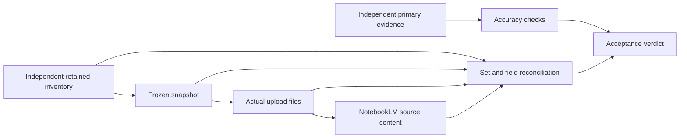

# แผนตรวจความถูกต้องของข้อมูล Macro และความครบถ้วนใน NotebookLM

วันที่จัดทำ: 2026-10-05

สถานะ: แผนตรวจรับ อิง working tree ที่อ่านในรอบนี้; ยังไม่ได้รันการตรวจตามแผนหรือส่งข้อมูลไปบัญชีจริง

แผนนี้ต่อจาก [แผน Research Companion](macro-notebooklm-research-companion-plan.md) และใช้ [แผนตรวจ Macro เดิม](macro-end-to-end-verification-plan.md) เป็นฐานสำหรับ source, calculation และ lineage เพิ่มการพิสูจน์การส่งออกจนถึง **เนื้อหา sources ใน NotebookLM จริง** การเขียนแผนนี้ไม่แก้โค้ดส่งออกหรือไฟล์ข้อมูลเดิม

## 1. สิ่งที่จะรับรอง

ตรวจรับเป็นสามข้อแยกกัน ก่อนสรุปภาพรวม:

1. **ข้อมูลถูกต้องและใช้ในบริบทที่ถูกต้อง:** ตัวเลขตรงหลักฐานต้นทางของ period/vintage เดียวกัน หน่วย/วันที่/สูตรถูกต้อง; แยก provider facts, deterministic calculations, AI interpretation และข้อมูล unverified/stale ตามจริง
2. **ส่งออกครบและไม่เปลี่ยนความหมาย:** ข้อมูล Macro ที่ยังมีอยู่ทั้งหมดภายในขอบเขตถูกจับใน snapshot ถูกเขียนในไฟล์ที่ส่ง และอยู่ใน sources ที่ NotebookLM นำเข้าสำเร็จ ไม่มี records, fields, ประวัติ, references หรือท้ายเอกสารถูกตัดหาย
3. **NotebookLM เป็น research companion:** ผู้ใช้ตรวจหลักฐานและค้นคว้าได้ ไม่มีการส่งคำตอบกลับไปเปลี่ยน Macro/พอร์ต ไม่มี Audio, Deep Research, Discord หรือการรัน agents เพิ่มโดย export workflow

การได้ HTTP 202, job `done`, manifest `ready`, source ID, ไฟล์ Markdown ไม่ว่าง หรือจำนวน sources ครบ **ไม่เพียงพอ** ต่อการรับรองข้อใดข้อหนึ่งโดยลำพัง

## 2. ช่องว่างที่เห็นจาก static inspection และต้องพิสูจน์ก่อนตรวจรับ

ข้อสังเกตต่อไปนี้มาจากการอ่านโค้ดปัจจุบัน ไม่ใช่ผลรันทดสอบ และต้องผูกกับ code digest ของรอบตรวจรับ เพราะ working tree มีงานพัฒนาอยู่แล้ว

| ID | ข้อสังเกตในโค้ด | ความเสี่ยง/สิ่งที่ต้องพิสูจน์ |
| --- | --- | --- |
| C01 | `_capture_market_observables()` ใน `tools/macro/adapters/macro_corpus_adapter.py` ใช้ cache keys หลายตัวต่างจาก provider adapters | data มีอยู่ใน cache แต่ export มองเป็น missing; commodity group ใช้ key OVX ตัวเดียว แม้ contract มี GVZ/VXSLV/OVX |
| C02 | `_read_historical_reports()` ใช้ `glob()` ที่ root ของ directories | อาจไม่พบ V2 reports ใน `Strategies/YYYY/MM/` และไม่ได้ enumerate committed artifacts ตาม receipts ทั้งหมด |
| C03 | `_read_indicator_series()` อ่านเฉพาะ indicators ของ latest dashboard และเรียก range `1y`; ไม่มี report คืนรายการว่าง | ไม่ใช่ full retained history และ series ที่ไม่มีใน latest report หาย |
| C04 | reader มีทั้ง `body_snippet=content[:3000]` และ `full_body`; formatter เลือก snippet ก่อน | เนื้อหาโน้ตเกิน 3,000 ตัวอักษรไม่ถูกส่งครบ |
| C05 | formatter ใช้ `allocations`/`themes` แต่ canonical report ใช้ `asset_allocation`/`focus_themes`; วน registry เสมือน list ทั้งที่ canonical เป็น dict | allocation, themes และ observable values อาจหายโดยไม่มี exception; ต้องตรวจ schemas จริง รวม risk/stance/confidence fields |
| C06 | historical formatter ลงรายละเอียด `history[:10]`; filtered news ใช้ `filtered[:20]`; หลาย market sections มีเพียง status | รายละเอียดประวัติ/ข่าว/ค่าตลาดถูกตัดหรือไม่ถูกเขียน ไม่ใช่การส่งทั้งหมด |
| C07 | structured appendix ปัจจุบันเขียนเพียง indicator points; `corpus.json` ฉบับเต็มไม่อยู่ใน upload inventory; builder กำหนดไว้ 9 Markdown files | ข้อมูลอยู่ local ไม่ได้แปลว่าอยู่ NotebookLM; จำนวน 9 เป็นจำนวนไฟล์ ไม่ใช่ coverage ของข้อมูล |
| C08 | `_read_sector_rotation()` อ่าน `snapshot.json` แต่ `SectorSnapshotStore.save()` เขียน `snapshots/<snapshot_id>.json` | latest identity อาจมีใน state แต่เนื้อหาจริง/retained history ไม่ได้เข้า snapshot |
| C09 | readers หลายจุดจับ exception แล้วคืน None/ว่าง/ข้ามรายการ; news reader อ่านเฉพาะ pending/filtered | ไฟล์เสียหรือข้อมูลอ่านไม่ได้อาจถูกนับว่าไม่มีอยู่จริง และ processed/context ที่ยังเก็บอยู่อาจตกหล่น |
| C10 | ใช้ `json.dumps(..., default=str)` และมี `getattr(...) or data.get(...)` | domain objects อาจกลายเป็น string; ค่า 0 อาจถูกแทนหรือเรียก `.get()` กับ object ที่ไม่รองรับ; types/precision ต้องตรวจ |
| C11 | pipeline บันทึก `status=success` หลัง readiness loop แม้ไม่พบ success หรือไม่มี source ID; source hash อ่านจาก inventory โดยไม่คำนวณ bytes ใหม่ | อาจแจ้งพร้อมทั้งที่ไม่พร้อม หรืออัปโหลดไฟล์ที่ถูกแก้แล้วโดย manifest ยังอ้าง hash เก่า |
| C12 | manifest loader คืน None ทั้งกรณีไม่พบและ corrupt; ไม่เห็น strict schema/profile binding หรือ remote-state reconciliation ใน research pipeline | retry อาจเริ่ม notebook ใหม่เมื่อประวัติเสีย; cached success อาจไม่ตรง source ที่มีจริง |
| C13 | bundle hash มาจาก rendered files ที่มี snapshot timestamp และไม่ครอบคลุม payload ที่ renderer ละไว้ | เวลาเปลี่ยนอาจสร้าง notebook ซ้ำ; field ที่ไม่ได้ render เปลี่ยนกลับไม่ทำให้ content identity เปลี่ยน |
| C14 | DTO มี fallback ให้ source status เป็น ready จาก parent state และ counts มาจาก inventory; service reconcile manifest แต่ไม่ได้รับ job reader port | UI อาจแสดงความสำเร็จที่ไม่มีหลักฐานราย source หรือค้างหลัง worker error/restart |
| C15 | tests ปัจจุบันตรวจหัวข้อ/ไฟล์ไม่ว่าง/จำนวน 9; sample market keys และบางโครงสร้างไม่ตรง snapshot ของ adapter | tests ผ่านได้แม้ตัวเลขสำคัญหาย ต้องใช้ production-shaped fixtures และ negative cases |

ตัวอย่าง cache mapping ที่ต้องตรวจด้วย fixture จาก provider จริง:

| กลุ่ม | Key ที่ export reader ใช้ขณะอ่าน | Key ที่พบใน provider code |
| --- | --- | --- |
| OFR | `ofr:financial_stress` | `ofr:fsi:latest` |
| BIS | `bis:policy_rates` | `bis:policy_rates:latest` |
| COT | `cftc:cot:metals:gold` | `cftc:cot:disagg:<commodity code>` |
| Commodity volatility | `cboe:volatility:OVX` | `cboe:commodity_vol:<symbol>` |
| SET flow | `settrade:investor_flow:SET` | `settrade:flow:SET` |
| SET valuation | `settrade:valuation:SET` | `settrade:stats:SET` |
| GTA gold | `goldtraders:retail_gold` | `goldtraders:retail:quote` |
| US debt | `treasury:debt:limit_30` | `treasury:debt:30` สำหรับ limit เดียวกัน |

Auction-demand และ crypto-liquidity ต้องตรวจ composition ของ service เพิ่มเติม ห้ามสมมติว่าผล aggregate มี cache key โดยอัตโนมัติ ส่วน keys ที่ตรงก็ต้องพิสูจน์ว่า API กับ export ใช้ cache instance/process เดียวกัน และ capture ได้ทุก component ที่มี

## 3. ขอบเขตและ expected inventory ที่เป็นอิสระจาก exporter

ใช้โหมด `all_retained` ตามแผนเดิม ไม่มี default ตัดประวัติเป็น 30 วัน/1 ปีหรือเลือก top records รวม:

- latest และ retained Macro reports: Markdown, canonical payload, same-day runs/revisions และ legacy reports ที่ยังมีอยู่
- observable registry ทุกตัว รวม uncited indicators, regional assessments, quant metrics, สูตร/derived inputs, warnings และ lineage
- Global/country/regional snapshots, Macro baselines และ indicator series ทุกจุดที่เก็บไว้ รวม series ที่ไม่อยู่ latest dashboard
- market data ทุก component ที่หน้า Macro ใช้: Treasury curve/auctions/debt, OFR, COT, BIS, GVZ/VXSLV/OVX, Thai flow/gold/valuation/breadth, crypto components และข้อมูล Macro อื่นที่เก็บไว้ใน typed sources
- Thailand official hard data, fiscal/bond/yield diagnostics และหลักฐานที่อ้างถึง; sector snapshots/history/evidence ที่ยังเก็บไว้
- Macro news events ทุกสถานะที่ยังมีใน store, report references, URLs, summaries, notes/transcripts ที่เก็บไว้และเชื่อมกับ Macro

ไม่รวมไฟล์ที่ถูกลบ/retired/quarantine, temp/backup, secrets, พอร์ต/ธุรกรรมส่วนตัว หรือเอกสารนอก Macro scope Archive/Revision ที่เป็นหลักฐาน canonical ของรายงานในขอบเขตต้องรวมผ่าน identity/receipt ไม่กวาด archive ทั้งหมดอย่างไร้เงื่อนไข

สร้าง expected inventory ด้วย **ตัวอ่านตรวจสอบอีกชุด** ที่ไม่เรียก `MacroCorpusAdapter.capture_snapshot()`, bundle builder หรือ formatter เพื่อสร้าง expected values ใช้ contract/config/schema, read-only catalog generation, committed receipts, scoped filesystem enumeration และ typed runtime/cache records แล้ว reconcile จำนวนกับ identities ที่ต้นทาง

ใช้ `tools/macro/contracts.py`, `ticker_config.py` และ `tests/fixtures/macro/data_lineage_matrix.json` เป็นจุดตั้งต้น ต้องตรวจว่ารายการ/นิยาม/SLA/known-degraded policy ตรง provider metadata จริง และเสริม fields ที่ contract ยังไม่ครอบคลุม ห้ามใช้ทั้งสองฝั่งของ comparator ที่มาจาก assumption เดียวกันเป็นหลักฐานอิสระ

ทุกรายการใน inventory ต้องมี logical ID, kind, provider/region, source locator, note/report/revision/series ID ตามประเภท, raw hash, observation/period/publication/capture dates, schema/formula version, quality status, requiredness และเหตุผล inclusion/exclusion สำหรับ mutable cache ต้องบันทึก snapshot ที่คัดลอก values จริง ไม่ถือว่าการเก็บ object reference คือ immutable snapshot

หาก catalog ขาด entry แต่ไฟล์ใน typed root ยังเป็นข้อมูลใน scope ให้เป็น reconciliation failure ที่ต้องจัดการ ไม่ลด denominator ตามสิ่งที่ exporter ค้นเจอ หากไฟล์มีอยู่แต่เสีย/อ่านไม่ได้ให้ระบุ `unreadable`/`integrity_failed`; หากต้นทางไม่เคยมีข้อมูลให้ `missing_upstream` แยกกัน

## 4. แบบพิสูจน์ความครบถ้วนและความถูกต้อง



กำหนดเซต `E` = eligible records จาก expected inventory, `S` = records ใน frozen snapshot, `B` = records ที่อยู่ในไฟล์ upload inventory จริง, `N` = records ที่อ่านกลับได้จาก sources ใน notebook/profile ที่กำหนด

เงื่อนไขส่งครบคือ `E = S = B = N` หลัง normalization/dedup ที่กำหนดก่อนรัน และ `missing/extra/duplicate_without_reason = 0` ต้องตรวจ values และ fields ทุก path ภายใน record ด้วย เซต IDs ที่เท่ากันแต่ value/unit/date/body หายถือว่า FAIL

เพิ่ม field ledger ที่ map `(logical_id, revision, field_path)` ไป `(upload_part, structured_block/section, remote_notebook_id, source_id)` และเก็บ hash ของ typed canonical value ตัวตรวจ decode structured blocks/เนื้อหาจริงกลับมา ไม่ใช้ ledger ที่ exporter เขียนเป็นคำยืนยันว่ามี field แล้ว

| ตัวชี้วัด | วิธีคำนวณ/เกณฑ์ |
| --- | --- |
| Discovery coverage | `|E ∩ S| / |E| = 100%`; schema fields/long-body/history points ต้องครบ |
| Upload payload coverage | `|E ∩ B| / |E| = 100%`; `corpus.json` local ไม่นับหากไม่ถูกส่งหรือไม่ได้แทนข้อมูลครบใน sources |
| Remote ingestion coverage | planned source parts ทุกส่วนมี remote identity และ terminal ingestion success ที่ยืนยันจริง |
| Remote content coverage | `|E ∩ N| / |E| = 100%` พร้อม field-value equality และข้อความเต็มที่แปลงกลับได้ |
| Value fidelity | value/type/sign/precision, unit, dates, status, formulas/refs คงเดิม; Markdown escaping เปลี่ยนได้เฉพาะ representation |
| Source verification coverage | quantitative facts ที่กำหนดให้ verified ทุกตัวมี primary evidence ของ period/vintage เดียวกัน; รายการที่พิสูจน์ไม่ได้ต้องระบุใน verdict ไม่เปลี่ยนเป็น verified เพราะ export สำเร็จ |
| Citation integrity | reference IDs resolve ได้ และ source/section ที่อ้างมีข้อความ/ค่ารองรับ claim จริง |

กรณี denominator เป็นศูนย์ไม่ให้ coverage 100% โดยอัตโนมัติ ต้องแสดง empty scope และไม่มี notebook research-ready ที่อ้างว่ามีข้อมูลครบ

ความต่างด้าน whitespace/line endings ของ remote text ยอมรับได้ตาม normalization policy ที่ทดสอบแล้ว แต่ต้องไม่ normalize จนลบเครื่องหมายลบ จุดทศนิยม `%`, หน่วย วันที่ ตัวเลข หรือท้ายเอกสาร หาก remote tool ไม่รองรับ full content ให้ตรวจจาก source viewer/export ที่อ่านเนื้อหาได้ครบตามความสามารถจริง; screenshots/คำตอบ chatbot/ตัวอย่าง quotes ไม่แทน full reconciliation ถ้ายังอ่านครบไม่ได้ให้ remote-content gate เป็น BLOCKED

## 5. ตรวจ source, เวลา และสูตรอย่างละเอียด

ใช้ raw/provider evidence ของวันที่และ vintage ที่ตรึง ไม่เปรียบเทียบ archived report กับตัวเลขล่าสุดแล้วสรุปว่ารายงานเดิมผิด หาก provider revise ค่า ให้ตรวจตาม vintage เดิมเมื่อมี evidence หรือระบุข้อจำกัดว่าประวัตินั้นยังรับรองไม่ได้ ห้ามใช้ checksum ที่ตรงเป็นหลักฐานว่าตัวเลขจริงถูกต้องโดยลำพัง

| Source family | ตรวจทั้งหมดใน scope | เกณฑ์สำคัญ |
| --- | --- | --- |
| Yahoo/FRED/global/regional | configured tickers/series, raw history, last/previous observation, frequency, real/nominal, SA/NSA และ currency | เทียบ raw bars/series metadata; ไม่ใช้ fetch date แทน bar date; ไม่เปลี่ยน definition เพื่อให้ coverage ผ่าน |
| US Treasury | curve ทุก tenor ที่มี, auctions/history, security type/term, bid-to-cover และ debt periods | yield เป็น %; spread bps ต่างจาก percentage points; Bill/Note และวันที่ประมูลไม่ปะปน |
| BIS/OFR/CFTC/CBOE | ทุก country/category/position/volatility component และ history ที่สูตรใช้ | รักษา fractional rates, report/publication lag, position units, GVZ/VXSLV/OVX และ percentile window |
| Thai official hard data | GDP/CPI/core CPI/MPI และ hard-data fields ทุก record พร้อม official evidence/period/history | local flag `verified` ไม่แทนเอกสารต้นทาง; unit/base year/YoY/QoQ/index ต้องตรง; PDF ต้องตรวจตาราง/หน้าเมื่อเป็นต้นทาง |
| Thai market/fiscal/bonds | investor classes, buy/sell/net, gold bar/ornament/bid/ask, PE/PBV/dividend yield, breadth counts, debt และ yield tenors | THB/million/billion, venue, observation/settlement dates, 0/null และ units ต้องไม่สลับ |
| Crypto | BTC/gold benchmarks, stablecoin supply/history/growth/constituents, ETF flows และ liquidity aggregate | ตรวจทุก component date/partial status; ratio definition/currency/spot-futures ระบุชัด; missing ETF ไม่กลายเป็น flow 0 |
| Sector rotation | retained snapshot IDs, daily/weekly bars, adjusted-price policy, returns/relative strength/ranks/ties และ evidence | ใช้ completed sessions และ snapshot ที่ report อ้าง; price returns ไม่เปลี่ยนชื่อเป็น fund flow |
| News/YouTube/AI narrative | URLs, publisher, published time, extraction status, retained body/transcript และ claims ที่อ้าง quantitative evidence | summary ไม่แทน full body ที่ยังเก็บอยู่; AI interpretation ไม่ถูกระบุเป็น provider fact; claims ไม่มี support ต้องเห็น limitation |

สร้าง independent calculation fixtures โดยไม่เรียก production calculation function เป็น oracle ตรวจ YoY/QoQ/change, spreads, ratios, flow sums, supply growth, correlations/percentiles และ scoring thresholds ตามสูตรที่ใช้จริง กำหนด tolerance ต่อสูตรไว้ก่อนรัน; export fidelity ต้องเท่าต้นทางหลัง typed normalization ไม่ใช้ numerical tolerance กลบการปัด/ตัดข้อมูล

ตรวจ 0, negative, null, missing, NaN/Infinity, percent-vs-fraction, precision, duplicate periods, missing lookback, non-synchronous dates, end-of-quarter labels และ timezone/calendar boundaries ตัวเลขที่ดูสมเหตุสมผลแต่ไม่มี input evidence ไม่ถือว่าผ่าน

ตรวจ freshness แยก per component โดยใช้ evaluation/snapshot date ที่ตรึง และ release/calendar semantics ค่าล้าสมัย/invalid เก็บเพื่อประวัติได้เมื่อป้ายถูกต้อง แต่ไม่เข้าสูตรเป็น current verified data ส่วนข่าว/คำอธิบายที่ unverified ต้องคง provenance และไม่มีการประกาศรับรองข้อเท็จจริงเกินหลักฐาน

## 6. ลำดับ Gate และหลักฐานที่ต้องเก็บ

| Gate | งาน | เงื่อนไขออกจาก Gate |
| --- | --- | --- |
| G0 | ตรึง code/config/scope/profile และ environment | บันทึก revision/working-tree digests; roots/worker/browser/auth/tool capabilities พร้อมและชัดเจน |
| G1 | สร้าง independent inventory/field contract และตรวจตัว checker | inventory ไม่พึ่ง exporter; negative mutations ถูกจับ; ทุก field/source family มีข้อกำหนด |
| G2 | ตรวจ primary evidence, schema, dates/units/freshness และสูตร | numerical/definition mismatches เป็นศูนย์; unverified/degraded แยกตาม policy ที่ตรึงไว้ |
| G3 | ตรวจ discovery/snapshot/bundle แบบ offline | `E=S=B` พร้อม field/body/history equality; raw unknown fields ไม่หาย; hashes/identity ถูกต้อง |
| G4 | ทดสอบ queue/API/UI/retry/failure แบบ mock และ regression | readiness/corrupt-manifest/ambiguous-write/race/disabled-worker cases ผ่าน; ไม่มี prohibited side effects |
| G5 | ส่ง frozen corpus จริงหนึ่งรอบและตรวจ remote | notebook/profile ถูกต้อง; planned sources อยู่จริงและนำเข้าสำเร็จ; `B=N` พร้อม full-content evidence |
| G6 | ตรวจ research citations, UI verdict และ recovery ตามหลักฐาน | ผู้ใช้เปิด sources/citations ได้; UI สอดคล้อง remote/content verdict; final artifacts/status ครบ |

G0–G4 ต้องผ่านก่อน G5 เพื่อลดการสร้าง notebook/quota ซ้ำ การตรวจตามแผนนี้ใช้รายงาน Macro ที่มีอยู่ ไม่รัน Manager/Quant/Economist ใหม่เป็นเงื่อนไข หากต้องสร้างรายงานใหม่ภายหลังให้เป็นขอบเขตอีกงานและไม่ปะปน evidence ของคนละ run

พื้นที่หลักฐานที่เสนอ:

```text
tests/artifacts/macro-notebooklm-verification/<acceptance_id>/
  manifest.json                 # code/config/scope/profile/tool schemas และ digests
  expected-inventory.json       # E และ exclusion/missing/unreadable reasons
  field-contract.json           # source definitions, transformations, freshness/tolerances
  raw/                          # primary payloads/PDF tables/metadata พร้อม vintage/hash
  snapshots/                    # frozen S, revisions, cache values และ report receipts
  bundle/                       # corpus, upload inventory และ bytes ที่ส่งจริง
  reconciliation/               # E-S, S-B, B-N, full field diffs และ formula checks
  remote/                       # notebook/source list, ingestion states และ full source text
  api-ui/                       # HTTP DTOs, job bindings, browser assertions/screenshots
  failures/                     # injection, mutation, retry/restart receipts
  tests/                        # commands, stdout/stderr, exit codes, JUnit
  cases.json                    # MN-01 ถึง MN-72 พร้อม evidence paths
  result.json
  completion.md
```

บันทึกเวลา UTC/Asia-Bangkok, lock digest, formula/schema/tool versions, export/report/run/snapshot IDs และ nonsecret profile fingerprint ทุก artifact ต้องผูก `acceptance_id` กับ source/bundle digests ไม่เก็บ auth cookies/API keys ลง evidence ค่าจริงที่จำเป็นต่อการตรวจเก็บในพื้นที่จำกัดการเข้าถึงตาม runtime ของแอป

เก็บ before/after checksums ของ production Macro reports, vault และ portfolio เพื่อพิสูจน์ว่าไม่มี writeback การทดสอบใช้ shadow vault/state DB/news store/sector root/export root; config ของ hard-data path ที่ยัง hardcode ต้อง inject/override ก่อนรัน ห้ามให้ test isolation อ้างว่าปลอดภัยโดยตรวจเพียง root ที่ปรับแล้วแต่ runtime sources ยังชี้ production

## 7. Acceptance matrix — 72 กรณีบังคับ

ทุกกรณีมี fixture/input identity, assertion, evidence path และผล `PASS/FAIL/BLOCKED/NOT_RUN` การนำไปทำจริงต้องมี parameterized subcases ครบทุก source/region/series/component ที่ inventory ระบุ ไม่เลือกทดสอบ provider เพียงตัวเดียวแทนทั้งกลุ่ม

### 7.1 Discovery และ retained corpus

| ID | การตรวจ | เงื่อนไขผ่าน/หลักฐาน |
| --- | --- | --- |
| MN-01 | enumerate expected corpus จาก catalog + scoped stores + receipts | ทุก eligible identity อยู่ expected inventory; reconcile catalog/file discrepancy ไม่ข้ามเงียบ |
| MN-02 | V1/V2 nested YYYY/MM และ catalog มากกว่า 100/500 entries | ดึงครบทุกหน้า/ทุก path โดยไม่ใช้ default limit เป็น coverage ceiling |
| MN-03 | latest/archived/same-day reports และ canonical-vs-projection duplicates | revision identity ถูกต้อง รายงานไม่เขียนทับกัน dedup มี mapping ไม่สูญเนื้อหา |
| MN-04 | uncited observable, orphan retained series, baseline และ history เกิน 1 ปี | captured records/points ครบแม้ไม่มีใน latest dashboard |
| MN-05 | ทุก market group/component ใช้ provider cache keys จริง | warm API cache แล้ว export capture values ตรง รวม GVZ/VXSLV/OVX และ composites |
| MN-06 | sector state/latest ID และ snapshots/history ทุก revision ที่เก็บอยู่ | อ่าน `snapshots/<id>.json`/evidence จริง ไม่ได้เฉพาะ state และไม่ refresh |
| MN-07 | news ทุกสถานะ, linked notes/transcripts/report references | retained bodies/URLs/metadata ครบ; ข้อมูลที่ถูก prune ก่อน cutoff ไม่ถูกอ้างว่ายังมี |
| MN-08 | unreadable/corrupt/missing file และ cache process mismatch | reasons ชัด; มีข้อมูลแต่ capture ไม่ได้เป็น failure ไม่ถูกนับ `missing_upstream` |

### 7.2 Primary evidence และการคำนวณ

| ID | การตรวจ | เงื่อนไขผ่าน/หลักฐาน |
| --- | --- | --- |
| MN-09 | raw numeric facts เทียบ primary provider/official evidence | values/definitions ของ period/vintage ที่ตรึงตรงทุก quantitative record ที่ต้อง verified |
| MN-10 | GDP/CPI/core CPI/MPI และ country-series metadata | real/nominal, SA/NSA, frequency/base year/unit/authority/history ถูกต้อง; no fabricated verification |
| MN-11 | %/fraction, THB/USD/million/billion, percent points/bps | normalization และ field units ตรง contract; scale errors ถูกตรวจได้ |
| MN-12 | zero/negative/null/missing/NaN/Infinity | 0/negative ถูกเก็บ; missing ไม่กลายเป็น 0; nonfinite ไม่หลุดเป็น valid JSON fact |
| MN-13 | independent YoY/QoQ/change/spread/ratio/supply-growth calculations | สูตรและ denominator/lookback/date alignment ตรง input evidence และ tolerance ที่ตรึง |
| MN-14 | flow/breadth/debt aggregation และ component completeness | sum/net/ratio reconcile ได้ทุก class/field; partial ไม่ถูกนับ full |
| MN-15 | sector returns/ranks/correlation/percentiles/derived risk metrics | independent fixture ตรง version/calendar/window/adjustment/tie policy ที่ report ใช้ |
| MN-16 | scores, confidence, regime/AI claims กับ evidence | thresholds/eligible inputs ถูกต้อง; narrative มี support หรือ limitation ชัด ไม่รับรอง interpretation เป็น fact |

### 7.3 เวลา คุณภาพ และ lineage

| ID | การตรวจ | เงื่อนไขผ่าน/หลักฐาน |
| --- | --- | --- |
| MN-17 | observation/effective/publication/fetch/evaluation/snapshot dates | field semantics ต่างกันตามจริง ไม่มีการแทน observation ด้วยวันนี้/mtime |
| MN-18 | holiday/weekend/timezone/quarterly label/publication lag | calendar และ release semantics ถูกต้อง รวม boundary ก่อน/หลัง cutoff |
| MN-19 | per-field freshness limit−1/limit/limit+1 และ missing/future dates | status/reason/eligibility ตรง policy; aggregate date ไม่ทำให้ component stale ดูสด |
| MN-20 | unverified/invalid/stale/degraded/partial ทุกชนิด | หมายเหตุส่งต่อครบ; current scoring ไม่ใช้ invalid; expected degradation อิง evidence ที่ตรวจแล้ว |
| MN-21 | snapshot vs latest เปลี่ยนระหว่าง capture | values/revisions เป็น coherent copy หรือ snapshot conflict; ไม่เก็บ mutable reference เป็น frozen data |
| MN-22 | report/sector/notes source IDs, receipts และ hashes | hash/identity binding ตรวจได้และ reject cross-run/cross-revision mismatch |
| MN-23 | historical revision/vintage ที่ provider แก้ย้อนหลัง | ตรวจตามต้นฉบับ/vintage; ไม่มีหลักฐานเก่าต้องระบุ unverified/BLOCKED ตามข้อกำหนด |
| MN-24 | lineage ของ uncited/derived/unknown schema fields | input IDs/formula/status/source section/units ครบ; unknown fields ไม่หายจาก export ledger |

### 7.4 Bundle และเนื้อหาที่ส่งจริง

| ID | การตรวจ | เงื่อนไขผ่าน/หลักฐาน |
| --- | --- | --- |
| MN-25 | independent `E=S=B` พร้อม full field comparison | ทุก record และ field อยู่ใน upload files; local corpus อย่างเดียวไม่นับ |
| MN-26 | canonical `asset_allocation`, `focus_themes`, dict registry และ risk fields | ชื่อ/โครงสร้างตาม schemas จริง; values ทั้งหมดอยู่ rendered/structured content |
| MN-27 | notes เกิน 3,000 chars, history >10, filtered news >20 | unique ท้ายข้อความ/record สุดท้ายและรายละเอียดทุก record ยังอยู่ ไม่ถูก snippet/slice |
| MN-28 | OFR/COT/BIS/vol/auctions/debt/gold/valuation/breadth/crypto full payload | ส่ง values และ metadata จริง ไม่ได้เพียง status/header/count |
| MN-29 | Pydantic/dataclass/dict/list/Decimal และ Unicode/Markdown escaping | decoded fields รักษา types และ precision; ไม่กลายเป็น object representation หรือ string fallback |
| MN-30 | mutation ทุก field รวม field ที่ UI ไม่แสดง | content key เปลี่ยนเมื่อข้อมูลเปลี่ยน; timestamp อย่างเดียวไม่สร้าง notebook ใหม่ |
| MN-31 | part splitting/size/source-count/quota และ multiple notebooks หากใช้ | record mapping ครบแม้ข้าม boundary; เกิน capacity ต้องไม่ truncate และไม่อ้าง ready |
| MN-32 | tamper/delete/replace upload file, inventory หรือ bundle ก่อน retry | ตรวจ actual bytes/hash/root/manifest binding ก่อน remote mutation; mismatch ต้อง fail/block |

### 7.5 NotebookLM remote sources และเนื้อหา

| ID | การตรวจ | เงื่อนไขผ่าน/หลักฐาน |
| --- | --- | --- |
| MN-33 | auth profile/notebook ownership และ installed tool schemas | fingerprint/IDs ตรงรอบตรวจ; capability อ่าน source/status ที่ใช้มีจริง ไม่เดา response shape |
| MN-34 | source_add คืน missing ID/error/raw response/processing | ไม่ถูกบันทึก success/ready; แยกสาเหตุ error และ partial counts ถูกต้อง |
| MN-35 | readiness polling หมดเวลา/unknown/error status | มี deadline; ต้องเห็น terminal ingestion success จริงก่อน ready |
| MN-36 | independent remote source listing เทียบ upload inventory | planned parts ทุกส่วนอยู่ใน notebook ที่ถูกต้อง ไม่มี duplicate/extra source ที่ไม่อธิบาย |
| MN-37 | full remote content readback และ `B=N` | ทุก field/body/history point ตรง; ได้แค่ summary/quotes/count ให้ BLOCKED ไม่ PASS |
| MN-38 | remote normalization/truncation/omitted last section | policy ยอมรับความต่างด้าน representation เท่านั้น; ท้ายข้อความหาย/ตัวเลขผิดต้อง FAIL |
| MN-39 | remote list/status ล้มเหลวชั่วคราวหรือ source ถูกลบหลัง upload | ไม่ใช้ local success แทน remote evidence; แสดง unknown/deleted และ recovery ตามจริง |
| MN-40 | research questions และ citations ใน NotebookLM | เปิด citation ถึง source/section ที่มี support ได้; คำตอบไม่แทนหลักฐานเนื้อหาฉบับเต็ม และไม่อ้างข้อมูลนอก snapshot |

### 7.6 Idempotency, retry และ recovery

| ID | การตรวจ | เงื่อนไขผ่าน/หลักฐาน |
| --- | --- | --- |
| MN-41 | corpus เดิมแต่ request time ต่าง/กดซ้ำ/parallel requests | มี export/job/notebook ชุดเดียวตาม content key; unique constraint ไม่หลุดเป็น HTTP 500 |
| MN-42 | timeout หลัง notebook/source สร้างจริงแต่ก่อน local save | reconcile remote ก่อน mutation ซ้ำ; พิสูจน์ไม่ได้ให้ blocked และไม่ retry โดยไร้หลักฐาน |
| MN-43 | N sources สำเร็จและหนึ่ง source ล้มเหลว | retry ใช้ bundle เดิม ส่งเฉพาะที่เหลือ ไม่สร้าง sources ที่สำเร็จแล้วซ้ำ |
| MN-44 | restart ระหว่าง capture/upload/verify/DB binding | durable evidence คงอยู่; queue/export/manifest states ตรงกันและ retry ได้ตาม stage |
| MN-45 | corrupt/unsupported/empty/conflicting manifest และ lost history | หยุดก่อน notebook_create/source_add; ไม่ถือว่าเป็น export ครั้งแรก |
| MN-46 | resume พบ bundle/part hash ต่างหรือ remote content ไม่ตรง | reject/integrity error ไม่ข้ามตาม local success record เพียงอย่างเดียว |
| MN-47 | สลับ profile และสอง process/Audio+export พร้อมกัน | profile binding/dedupe แยกบัญชี และ session lease ร่วมป้องกัน MCP ผูกบัญชีผิด |
| MN-48 | dispatch/DB update ล้มเหลวและ orphan bundle หลัง dedup | job/export binding กู้ได้ ไม่มี remote creation ที่ไร้ record; retry ล้าง error fields ตามจริง |

### 7.7 API และหน้า Macro

| ID | การตรวจ | เงื่อนไขผ่าน/หลักฐาน |
| --- | --- | --- |
| MN-49 | auth/session, export ID visibility และ invalid mode | route/status ตรง contract; unauthorized ไม่เห็น corpus/notebook และไม่มี mutation |
| MN-50 | `latest`/by-ID/retry/404/409/503 และ worker disabled | static route ไม่ถูกจับเป็น ID; worker disabled ไม่ปล่อย queued ค้าง; typed errors ชัด |
| MN-51 | DTO counts/progress/coverage เทียบ ledger+remote | แยก files/records/fields/points; ไม่มี source manifest ต้องไม่ใช้ parent state เติม ready |
| MN-52 | snapshot/report IDs และ source quality บน API/UI | อยู่ revision เดียวกับ export; expired cache แสดง stale; missing/warnings ไม่ซ่อน |
| MN-53 | ทุกแท็บ AI/US/TH/cross-border และ mobile | button/status/notebook links เหมือนกัน; export ไม่ผูก active tab หรือทำให้หน้าอ่านไม่ได้ |
| MN-54 | refresh market ระหว่าง export/reload/unmount/response order | ชุดส่งยังตรึง; UI ไม่เอา response เก่าทับใหม่; polling มีขอบเขตและ reload แสดงงานเดิม |
| MN-55 | ไม่มี AI report แต่มี history/cache และกรณี empty corpus | ส่งข้อมูลที่มีได้พร้อม gap; empty ไม่สร้าง ready ปลอม; counts ไม่ใช้ denominator default กลบข้อมูลขาด |
| MN-56 | partial/blocked/failed/ready_with_warnings และหลาย notebooks | ผู้ใช้เห็นรายการที่ยังไม่ส่ง/ขอบเขตแต่ละเล่ม; retry และ open links ตรง sources จริง |

### 7.8 Research companion และขอบเขตข้อมูล

| ID | การตรวจ | เงื่อนไขผ่าน/หลักฐาน |
| --- | --- | --- |
| MN-57 | instrument MCP/application calls ทุก normal/retry/error path | `studio_create`, Audio/download, Deep Research/import, Discord/notifications เป็นศูนย์ |
| MN-58 | instrument manager/model/agent/scoring invocations | export ไม่รัน Manager/Quant/Economist หรือ model เพื่อย่อ/แก้ข้อมูล |
| MN-59 | before/after Macro/portfolio/report checksums และ writes | ไม่มี writeback จาก export/NotebookLM answer รวม failure/retry paths |
| MN-60 | allowed roots/traversal/symlink/relative inventory path | uploads อยู่ export root ที่อนุญาต; อ่าน corpus ตาม typed scope ไม่ตาม arbitrary paths |
| MN-61 | secrets/accounts/holdings/transactions/unrelated notes | field/scope policy กันออกโดยไม่ทำลาย Macro values; remote ไม่มีข้อมูลนอกขอบเขต |
| MN-62 | payload ข้อความสั่งอัปโหลดไฟล์/ใช้ tool/writeback | เป็น source content เท่านั้น ไม่เปลี่ยน workflow/scope หรือ tool invocations |
| MN-63 | facts/calculations/AI/external/unreviewed labels และ guide | roles/quality/source/time ชัด ไม่รับรอง AI/context เป็น verified fact |
| MN-64 | original NotebookLM Audio flow regression | integration ของ flow ใหม่ไม่เปลี่ยน Audio API/manifest/queue allowlist ของ flow เดิม |

### 7.9 ทดสอบตัวตรวจให้จับความผิดจริง

| ID | การตรวจ | เงื่อนไขผ่าน/หลักฐาน |
| --- | --- | --- |
| MN-65 | ลบ record/field/body tail หนึ่งรายการจาก snapshot หรือ bundle | checker FAIL และชี้ logical ID/field path/stage ที่หาย |
| MN-66 | เปลี่ยน value/sign/unit/date/status หนึ่ง field | checker FAIL แม้ counts/IDs/file size ยังเท่าเดิม |
| MN-67 | เปลี่ยน manifest ให้ ready แต่ remote ยัง processing/missing | checker ไม่เชื่อ local status; FAIL/BLOCKED พร้อม remote evidence |
| MN-68 | จำลอง payload truncation/default-str/false zero และ wrong cache key | independent oracle จับทุก mutation ไม่ใช้ assumption ร่วมกับ renderer |
| MN-69 | checker throw/timeout/skip mandatory test/missing evidence | exit code ไม่เป็น 0; partial results ถูกเก็บ; ไม่ catch แล้ว PASS |
| MN-70 | ป้อน audit result เก่าหรือคนละ bundle/code hash | reject stale evidence ไม่ถือว่าผลผ่านเดิมรับรอง current revision |
| MN-71 | ปรับ timestamp-only และ hidden field mutation แบบคู่ตรงข้าม | test พิสูจน์ semantic identity และ value coverage จริง ไม่เทียบ fixture เดิมกับตัวเอง |
| MN-72 | independent final verdict จาก cases/evidence/artifact digests | ไม่มี mandatory NOT_RUN/BLOCKED/FAIL; evidence ครบและ production ไม่เปลี่ยนก่อนประกาศ full PASS |

## 8. งานเตรียมตัวตรวจและลำดับแก้ช่องว่าง

| งาน | จุดที่ต้องเพิ่ม/ตรวจ | Definition of Done |
| --- | --- | --- |
| W01 | independent inventory + field contract fixtures | enumerate ครบ; typed identity/dates/schema ครบ; expected ไม่เรียก exporter |
| W02 | corpus adapter/read ports/cache registry | nested/history/series/news/sector ครบ; errors/quality reasons ไม่ถูกกลืน; snapshot ไม่ถือ mutable reference |
| W03 | formatter/builder และ structured record blocks | canonical payload/body/unknown fields อยู่ upload parts จริง; content key แยกเวลาส่ง |
| W04 | manifest/pipeline/MCP adapter | ตรวจ hashes จริง, strict load/profile/pending operations, ingestion และ remote readback |
| W05 | service/repository/queue/DTO/UI | race/restart/disabled worker/idempotency/progress ตรง evidence; missing status ไม่ถูกเติมเป็น ready |
| W06 | checker negative fixtures และ test harness | MN-65–MN-71 จับ false pass ได้ก่อนใช้ live quota; isolation ทุก runtime root |
| W07 | live acceptance และ completion artifacts | ตรวจหนึ่ง bundle ที่ตรึง; remote content ครบ; citations เปิดได้; verdict อิงทุก stage |

ชื่อ tooling ใหม่ที่เสนอ **ยังต้องสร้างก่อนใช้**:

- `scripts/audit_macro_notebooklm_export.py`: ตรวจ independent inventory, bundle field/content mapping และ hashes แบบ offline/read-only
- `scripts/run_macro_notebooklm_acceptance.py`: orchestrate gates, fixture/live modes, remote evidence และรวม verdict โดยไม่เรียก agents
- tests ใหม่ของ corpus discovery, applicationservice, researchmanifest/pipeline, independent comparator และ false-readiness/retry scenarios
- fixtures ใหม่ใน `tests/fixtures/macro/notebooklm/`: production-shaped canonical reports, cache/domain objects, long texts, nested archives, full series, oversized parts และ normalized remote responses

ใช้ `scripts/verify_macro_data_pipeline.py` และ `scripts/audit_macro_page_data.py` เป็น diagnostics ประกอบ ไม่ใช้ผล live คนละ run แทน primary evidence ของ export bundle ผล `tests/audit_macro_*_result.json` ที่อ่านเป็นรอบก่อนหน้า และจำนวน observables เดิมไม่ใช่ expected counts ถาวร

## 9. ชุดตรวจที่มีอยู่และการรันเมื่อเริ่มตรวจจริง

เตรียม shadow/config และตรวจ side effects ของ scripts ก่อนรันทุกคำสั่ง รายการนี้เป็นแผนการรัน ไม่ใช่ log ว่ารันแล้ว

Backend จาก repo root:

```powershell
.\.venv\Scripts\python.exe -m pytest tests/tools/macro/test_macro_notebooklm_bundle.py tests/api/test_routes_macro_notebooklm.py tests/unit/application/test_notebooklm_service.py tests/tools/content/test_notebooklm_pipeline.py tests/api/test_notebooklm_worker.py
.\.venv\Scripts\python.exe -m pytest tests/tools/macro/test_ingest_lineage.py tests/tools/macro/test_scoring_and_evaluation_guardrails.py tests/tools/macro/test_thailand_macro_adapters.py tests/unit/market/test_macro_publication_calendar_freshness.py tests/unit/terminal_v2/test_ttl_cache.py tests/unit/test_derived_and_risk.py
```

Frontend จาก `web`:

```powershell
npm run test -- src/pages/Macro.test.tsx src/components/macro/cockpit/MacroNotebookLMExport.test.tsx src/components/kanban/NotebookLMCardDetail.test.tsx
npm run check:types
npm run build
```

จากนั้นรันชุดใหม่ตาม MN matrix พร้อม negative cases แล้วจึงตรวจบัญชีจริงด้วย installed connector/tool schemas และ browser จริงใน G5–G6 การส่งไป NotebookLM และ manual research questions อยู่ขั้นตรวจรับเมื่อเริ่มงาน ไม่เกิดขึ้นระหว่างการสร้างแผนนี้ หากต้องอ่าน PDF/ใช้ browser ให้ใช้ skills ที่เกี่ยวข้องตอนตรวจจริง

Regression ที่มีอยู่ยืนยัน compatibility เท่านั้น ต้องไม่ใช้หัวข้อ Markdown ที่มี/ไฟล์ 9 ไฟล์/HTTP status ถูกต้องแทนการพิสูจน์ numerical และ content coverage ตาม G1–G5

## 10. สถานะ ผลรับรอง และเกณฑ์จบงาน

| ผลกรณีตรวจ | ความหมาย | exit code รวมเมื่อมีผลนี้ |
| --- | --- | --- |
| PASS | assertions ครบและ evidence ตรง revision/bundle | `0` เฉพาะทุกกรณีบังคับ PASS และไม่มี blocker |
| FAIL | พบข้อมูล/การส่ง/พฤติกรรมขัด contract | `1` และเก็บรายการ diff ครบ |
| BLOCKED / NOT_RUN | ขาด primary evidence/auth/capability/browser หรือยังไม่ได้ตรวจ | `2` เมื่อไม่มี FAIL แต่ยังตรวจไม่ครบ |
| ERROR | ตัวตรวจเองล้มเหลว/ผลไม่สามารถประเมินอย่างน่าเชื่อถือ | `3`; ไม่แปลงเป็น PASS |

ระบุ precedence ใน runner: checker ERROR ก่อน FAIL ก่อน BLOCKED ก่อน PASS; เก็บผลทุกกรณีแม้รอบรวมล้มเหลว การใช้ N/A ทำได้เฉพาะ subcase ที่อยู่นอก scope ที่ตรึงพร้อมเหตุผล ไม่ตัด MN mandatory case ภายหลังเพื่อให้ผ่าน

`result.json` แยก verdicts อย่างน้อย `source_accuracy`, `calculation_and_lineage`, `discovery_completeness`, `bundle_completeness`, `remote_ingestion`, `remote_content_completeness`, `research_companion_boundary`, `api_ui_recovery` พร้อม expected/actual counts, missing/changed/extra records, unverified facts, warnings และ evidence paths

ผลส่งออก `ready_with_warnings` ใช้ได้สำหรับข้อมูล historical/stale/unreviewed ที่มีป้ายตาม policy และส่งครบ แต่ไม่ยกระดับ source_accuracy ให้ PASS หาก facts ที่ต้อง verified ยังพิสูจน์ไม่ได้ ส่วน `partial` หมายถึงส่งไม่ครบและไม่ผ่าน remote completeness แม้เปิด notebook ได้

หากแก้ code/config/formula/input ระหว่างรอบ ให้ปิดรอบนั้นพร้อมผลและเริ่ม acceptance ใหม่ด้วย digests ใหม่ ไม่รวม PASS จากคนละ revision เป็นรอบเดียว การรันซ้ำใช้ local mock/fixtures ให้เสร็จก่อนใช้ remote quota และไม่ลบหรือแก้ production notes/notebooks เดิมเพื่อกลบผลที่ไม่ผ่าน

**จบงานเมื่อ** ทุก mandatory case ผ่านตามขอบเขตที่ตรึง, facts/สูตร/quality/lineage มีหลักฐานเพียงพอ, `E=S=B=N` ทั้ง records และ fields, NotebookLM sources พร้อมจริง, ผู้ใช้เปิด citation ถึงหลักฐานได้ และยืนยันว่าไม่มีการสร้าง Audio/Deep Research/notifications/agents หรือ writeback ไป Macro/portfolio โดย export flow

ส่งมอบ `completion.md` พร้อม code/bundle/export/notebook IDs, coverage แยก stage, ข้อจำกัด/ข้อมูลที่ยัง unverified และลิงก์หลักฐาน ไม่สรุปว่า “ข้อมูลถูกต้องและส่งครบ” จากจำนวน sources หรือข้อความสำเร็จในหน้าเว็บเพียงอย่างเดียว
