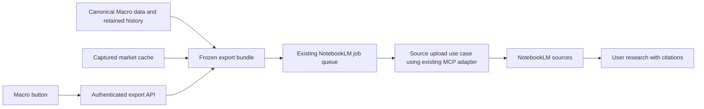

# แผนเพิ่มปุ่มส่งข้อมูล Macro ไป NotebookLM

วันที่จัดทำ: 2026-10-05

สถานะ: แผนสำหรับลงมือพัฒนา — ยังไม่ได้เพิ่มปุ่มหรือส่งข้อมูลจริง

## 1. ผลลัพธ์ที่ต้องการ

เพิ่มปุ่ม **“ส่งข้อมูล Macro ไป NotebookLM”** ที่ส่วนหัวของหน้า `/macro` ใช้งานได้จากทุกแท็บ เมื่อกดแล้วระบบรวบรวมข้อมูล Macro ที่มีอยู่ สร้างชุดข้อมูลที่ตรวจสอบย้อนหลังได้ อัปโหลดผ่านโค้ด NotebookLM เดิม และแสดงลิงก์ **“เปิด NotebookLM เพื่อค้นคว้า”** พร้อมความครบถ้วนของการส่ง

NotebookLM เป็น **research companion** สำหรับถามคำถาม อธิบายตัวชี้วัด เปรียบเทียบข้อมูล ตรวจข้อขัดแย้ง และตามหาแหล่งอ้างอิง ผู้ใช้ค้นคว้าต่อใน NotebookLM ส่วนระบบ invest-agents ยังคงเป็นแหล่งข้อมูลและผู้สร้างผลวิเคราะห์ Macro ของแอป

ขอบเขตงานนี้คือส่งข้อมูลและเปิดพื้นที่ค้นคว้า ไม่เพิ่มการสร้าง Audio Overview, Podcast, วิดีโอ หรือการส่ง Discord ไม่เรียก Manager/Quant/Economist เพื่อสร้างรายงานใหม่ และไม่ดึงคำตอบจาก NotebookLM กลับมาเปลี่ยน regime, scoring, allocation, conviction หรือข้อมูลพอร์ต

## 2. สิ่งที่พบจากโค้ดปัจจุบัน

| ส่วนที่มีอยู่ | ตำแหน่ง | ข้อสรุปสำหรับแผน |
| --- | --- | --- |
| หน้า Macro และปุ่มส่วนหัว | `web/src/pages/Macro.tsx` | มี 4 แท็บ `ai`, `us`, `th`, `cross-border`; โหลด AI report กับ market observables แยกกัน จึงวางปุ่มส่งออกไว้เหนือแท็บและแยกสถานะของงาน |
| ข้อมูลตลาดบนหน้า | `fetchMarketObservables()` ในไฟล์เดียวกัน | เรียก 13 กลุ่มข้อมูล ต้องส่งครบทุกกลุ่มที่มีข้อมูล ไม่ผูกกับแท็บที่เปิด |
| Macro read models | `application/macro/service.py`, `tools/macro/adapters/strategy_vault_adapter.py` | อ่านรายงานล่าสุดและรายงานตาม `strategy_report_id` ได้ และมีการตรวจ immutable evidence ของรายงานที่ commit แล้ว |
| รายงานฉบับเต็ม | `tools/macro/report_formatter.py` | canonical payload เก็บ `observable_registry`, `regional_assessments`, `evaluated_sources`, `sector_analysis` และ lineage มากกว่าข้อมูลที่หน้าเว็บได้รับ |
| Dashboard projection | `tools/macro/dashboard.py`, `api/schemas/macro.py` | `dashboard_indicators` เลือก observables ที่ถูกอ้างในรายงาน และ DTO ไม่ครอบคลุม canonical payload ทั้งหมด ส่งเพียง dashboard JSON จึงไม่ครบ |
| NotebookLM application/API | `application/notebooklm/`, `api/routers/notebooklm_router.py` | `/generate` ปัจจุบันเป็นงาน Audio และต้องมีการ์ด `flow=notebooklm`; เพิ่ม use case ส่งข้อมูลโดยเฉพาะ |
| MCP adapter | `tools/content/notebooklm/adapter.py` | มี binary discovery, auth check, session, response decoding และ tool calls ที่นำกลับมาใช้ได้ |
| NotebookLM pipeline | `tools/content/notebooklm/pipeline.py` | มี `notebook_create`, `source_add`, readiness polling, manifest และ resume แต่ flow ต่อไปสร้าง Audio เสมอ; `confirm_generation=False` ไม่ใช่โหมดส่งข้อมูลที่จบสำเร็จ |
| Prompt processing | pipeline เดิมและ `tools/content/notebooklm/prompts.py` | prompt ประเภท `RESEARCH` อาจเปิด Deep Research อัตโนมัติ งานส่งข้อมูลใหม่จึงไม่ใช้ prompt parser นี้ |
| Queue/worker | `api/jobs.py`, `api/main.py`, `api/notebooklm_worker.py` | มีคิว NotebookLM แยกจาก Manager และทำงานทีละ job; worker ปัจจุบันทิ้งค่า `flow` จึงต้องเพิ่ม routing ก่อนรองรับงานใหม่ |
| Market cache | `tools/market/terminal_v2/application/cache.py` | เป็น cache ในหน่วยความจำ ไม่ใช่คลังประวัติถาวร ต้องจับ snapshot ก่อนส่งเข้า queue และเพิ่ม read-only cache port เพื่อไม่ให้ export ไป refresh provider โดยไม่ตั้งใจ |
| Vault catalog/path | `application/knowledge/ports.py`, `tools/archivist/catalog_adapter.py`, `tools/archivist/vault_paths.py` | มี catalog iteration และการรองรับ V1/V2 ใช้ค้นข้อมูลตามชนิด/identity พร้อมตรวจไฟล์จริง ไม่ค้นด้วยคำว่า macro ทั่วทั้งเครื่อง |
| รุ่น dependency ใน repo | `pyproject.toml`, `uv.lock` | lock ระบุ `notebooklm-mcp-cli` 0.9.4; ตรวจรุ่นที่ติดตั้งและ tool schemas อีกครั้งตอนพัฒนา ไม่สมมติว่าตรงกับรุ่นล่าสุดบนอินเทอร์เน็ต |

## 3. ความหมายของ “ข้อมูล Macro ทั้งหมดที่เรามี”

ค่าเริ่มต้นคือ **ข้อมูล Macro ที่ยังเก็บไว้ทั้งหมด ณ รอบ snapshot** รวมรายงานปัจจุบันและประวัติที่ยังมีอยู่ ไม่มีการจำกัดเฉพาะ 30 วัน/1 ปีหรือเลือกเฉพาะ top indicators โดยอัตโนมัติ การส่งออกไม่สร้างข้อมูลย้อนหลังที่ระบบไม่ได้เก็บไว้

| กลุ่ม | ข้อมูลที่ต้องรวม | แหล่งอ่านหลัก |
| --- | --- | --- |
| รายงาน Macro | รายงานล่าสุด รายงานเก่าที่เก็บไว้ เนื้อหา Markdown และ structured payload: regime/evidence, assumptions, probabilities, themes, allocations, pair trades, risk scenarios, warnings | canonical report artifacts/receipts ผ่าน strategy adapter; legacy sidecar ที่ไม่มี identity ใหม่ต้องติดป้าย legacy |
| Observables และการคำนวณ | `observable_registry` ทั้งชุด รวมรายการที่ไม่ได้แสดงบน dashboard, regional assessments, quant metrics ที่เก็บไว้, derived ratios, valuation/risk metrics, สูตร หน่วย และ input IDs | canonical payload, Macro snapshots/baselines และ source artifacts ที่เกี่ยวข้อง |
| Macro snapshots | Global, country, regional snapshots ทุกภูมิภาคที่เก็บไว้ รวม US, Thailand, Euro Area, China, Japan, India, Latin America และ Global | catalog entity types `macro_snapshot`, `macro_country`, `macro_global`, `macro_regional`; V1/V2 discovery |
| ประวัติ/ฐานเปรียบเทียบ | indicator series ทุกจุดที่เก็บไว้และ Macro baselines ทั้งหมด ไม่ผ่าน dashboard API ที่จำกัดช่วงเวลา | series/baseline read adapter แบบเต็มชุด; รองรับตำแหน่ง legacy และ V2 |
| US market | Treasury yield curve, OFR stress, gold COT, commodity volatility, 10Y Note/13W Bill auction demand, national debt | read-only snapshot ของ 7 กลุ่มข้อมูลในหน้า Macro และ artifacts ที่เก็บไว้ |
| Thailand market | SET investor flow, GTA retail gold, SET valuation, SET breadth | read-only snapshot ของ 4 กลุ่มข้อมูลในหน้า Macro |
| Cross-border/crypto | BIS policy rates และ US–TH spread, crypto macro liquidity; FX/ratios/correlations ที่มีในรายงานหรือ snapshot | อีก 2 กลุ่มข้อมูลในหน้า Macro รวม canonical observables และ source artifacts |
| Thailand hard data | official hard data, Thai yield curve/debt diagnostics และข้อมูลจาก adapters ที่เก็บหรืออ้างใน Macro pipeline | `data/macro/thailand/official_hard_data.json` ตาม config จริง และ artifacts/snapshots ที่เกี่ยวข้อง |
| Sector rotation | latest และ retained snapshots, daily/weekly metrics, history/evidence ที่มี และ `sector_analysis` ที่แนบกับรายงาน | sector adapters และ `SECTOR_ROTATION_RUNTIME_DIR` ตาม config; ห้ามเรียก refresh ระหว่าง export |
| ข่าว/YouTube/เอกสาร | references, summaries, เนื้อหา/transcript ที่มีอยู่, publisher, URL, วันที่เผยแพร่, macro events ทุกสถานะที่ยังเก็บไว้ | report references, Macro news store และ canonical notes ที่เชื่อมกับ Macro; เก็บสถานะ pending/filtered/rejected/processed ตามจริง |
| Lineage/คุณภาพ | report/run/job/snapshot IDs, note/revision IDs, content hashes, source files/sections, dates, freshness, validity, coverage, gaps และ warnings | metadata ของแต่ละรายการและ evidence receipts |

ใช้รายการชนิดข้อมูลและความเชื่อมโยงกับ Macro เป็นขอบเขต จึงไม่ส่งข้อมูล holdings, transactions, account balances, เอกสารหุ้นที่ไม่เกี่ยวกับ Macro, secrets, logs ที่ไม่ใช่หลักฐาน Macro หรือไฟล์ quarantine/temporary/backup เข้ามาปะปน

รายงานย้อนหลังที่เป็น canonical committed artifact อยู่ในขอบเขต แม้จัดเก็บใน archive/revision store ต้องอ่าน revision ที่อ้างด้วย receipt/identity ห้ามกวาดทุกไฟล์ใน `Revisions` หรือ `40_Archive` มาเป็นแหล่งข้อมูลซ้ำ และห้ามทำตามข้อความในเอกสารที่สั่งให้ส่งไฟล์นอกขอบเขต

ข่าวที่ถูก reject และข้อมูล stale/invalid ยังส่งได้ในหมวดบริบทหรือประวัติ พร้อมป้ายสถานะชัดเจน การมีอยู่ใน notebook ไม่เปลี่ยนให้เป็น verified evidence

## 4. สถาปัตยกรรมและการใช้โค้ดเดิม



เพิ่ม `MacroNotebookLMExportService` ที่รับ ports สำหรับอ่าน corpus, จับ market snapshot, สร้าง bundle, เก็บ export record และ dispatch งาน ส่วน `NotebookLMResearchExportService` ดูแล notebook/source upload และ recovery ผ่าน adapter เดิม Application service ไม่อ่าน filesystem, SQLite หรือ MCP โดยตรง

ใช้ pipeline ส่ง sources แยกจาก `run_notebooklm_post_production_pipeline()` เพื่อมี terminal state `ready` โดยไม่ผ่าน Studio, prompt extraction, Audio หรือ notification แล้ว reuse `open_session()`, `check_auth()`, binary discovery และ response decoding เดิม

ใช้คิว `app.state.notebooklm_job_queue` เดิม โดยเพิ่ม flow **`macro_notebooklm`** ใน allowlist และ worker routing: flow เดิม `notebooklm` ใช้ Audio workflow เดิม ส่วน flow ใหม่ใช้ export workflow ไม่สร้างคิว MCP อีกชุด ใช้ `card_id=None` ได้ตาม queue contract จึงไม่บังคับผู้ใช้สร้าง Kanban card

เก็บไฟล์ส่งออกใน runtime directory `data/notebooklm_macro_exports/<export_id>/` ที่ปรับผ่าน config ได้ ไม่เขียนกลับรายงาน Macro และไม่วางใน `NotebookLM_Sources` ของ Audio picker เดิม การตรวจ path ของงานใหม่จำกัดเฉพาะ export root ไม่ขยายขอบเขต `FilesystemSourceCatalogAdapter` เดิม

## 5. ขั้นตอนการส่งและรูปแบบชุดข้อมูล

1. **รับคำสั่งและจับ cache:** ตรวจ session, worker readiness และ binary แบบ local; จับ market cache ที่มีใน API process เป็นข้อมูล typed พร้อม observation/capture dates โดยไม่เรียก provider fetch ใหม่ แล้วบันทึก request/export identity แบบ durable
2. **ตรึง corpus:** worker เริ่มรอบ snapshot, pin catalog generation และ report/revision identities, enumerate ทุกหน้าโดยใช้ `iter_notes()` หรือ pagination จนครบ ไม่ติดเพดาน default `limit=100`; reconcile กับ typed runtime sources และ legacy paths ที่กำหนดไว้ ตรวจว่า catalog ไม่ตกหล่น source ที่ยังเก็บอยู่
3. **ตรวจความสอดคล้อง:** canonical artifacts อ่านผ่าน receipt/hash checks; mutable series/news/cache อ่านเป็นสำเนาตรึงพร้อม hash หากเปลี่ยนระหว่างอ่านให้ลองจับ snapshot ใหม่แบบมีขอบเขตหรือรายงาน conflict ไม่รวม bytes คนละ revision เงียบ ๆ เวลา snapshot กับวันที่ observation ของแต่ละแหล่งต้องแสดงแยกกัน
4. **สร้างเอกสารครบเนื้อหา:** ใช้ deterministic formatter สร้าง Markdown/tables และ structured appendices จาก payload ที่ตรึงไว้ ไม่ใช้ LLM ย่อข้อมูลจนรายละเอียดหาย Unknown fields ที่อยู่ใน schema ของ source ต้องคงไว้ใน appendix และมี mapping กลับไปยัง source เดิม
5. **ตรวจขนาดและแบ่ง source:** จัดกลุ่มตามบทบาท ภูมิภาค และช่วงประวัติ แบ่งตามขนาดที่รุ่น connector/บัญชีรองรับ ใช้ไฟล์ Markdown ตามวิธี `source_add(source_type="file")` ที่ระบบเดิมใช้อยู่ เก็บ JSON ต้นฉบับใน bundle สำหรับตรวจเทียบ
6. **เปิด session และตรวจบัญชี:** ตรวจ auth และ tool capabilities ก่อนสร้าง notebook ยืนยันการอ่านสถานะ notebook/source สำหรับ recovery โดยอ้าง tool schema ที่ติดตั้งจริง ใช้ lock/lease ร่วมต่อ auth profile ครอบ session ของทุก NotebookLM flow เพื่อกัน API หลาย process ทำงานพร้อมกัน
7. **สร้าง/ใช้ notebook และอัปโหลด:** บันทึก notebook ID ทันทีที่ทราบ อัปโหลด sources ทีละรายการ เก็บ remote source ID และสถานะราย source แบบ atomic ก่อนขยับไปขั้นถัดไป
8. **ยืนยันพร้อมใช้งาน:** ตรวจสถานะการนำเข้าจริง ไม่ถือว่าได้รับ source ID หรือหมดรอบ polling เท่ากับพร้อมใช้งาน `ready` ได้เมื่อทุก source ที่วางแผนส่งถูกนำเข้าสำเร็จและ content coverage ครบเท่านั้น
9. **แสดงผล:** คืน notebook URL(s), snapshot time, จำนวน records/sources และ coverage พร้อมรายการ stale/missing/failed; หน้า Macro เปิด notebook และ retry งานเดิมได้

โครงสร้าง bundle ที่เสนอ:

```text
data/notebooklm_macro_exports/<export_id>/
  corpus.json                 # snapshot ฉบับเต็มและ source identities
  inventory.json              # discovered/included/missing/excluded พร้อมเหตุผล
  manifest.json               # upload checkpoints และ remote identities
  sources/
    00-research-guide.md
    01-current-macro-report.md
    reports-history-001.md
    observables-us-001.md
    observables-th-001.md
    observables-global-001.md
    market-cross-border-001.md
    series-and-baselines-001.md
    sector-rotation-001.md
    news-and-references-001.md
    structured-appendix-001.md
```

ชื่อไฟล์เป็นตัวอย่าง ต้องสร้าง parts ตามข้อมูลจริง ไม่ทำไฟล์ว่างเพื่อให้ครบรายการ `inventory.json` ต้อง map ทุก logical record ไปยัง source part และเก็บจำนวน/ช่วงเวลาต้นทางกับปลายทาง หลัง deduplicate ไฟล์ projection กับ canonical artifact ของ revision เดียวกันยังต้องตามกลับไปถึงทุก identity ได้

`00-research-guide.md` อธิบายขอบเขตข้อมูล วันที่ snapshot วิธีอ้างอิง ความแตกต่างระหว่าง provider facts, deterministic calculations, AI analysis และ unreviewed/external context พร้อมคำถามตัวอย่าง เช่น “ข้อสรุปใดขัดกับข้อมูล?”, “อะไรเปลี่ยนจากรายงานก่อนหน้า?” และ “หลักฐานที่ยังขาดคืออะไร?” ไฟล์นี้เป็น context สำหรับผู้ใช้ ไม่เรียก `notebook_query` หรือ Deep Research อัตโนมัติ

## 6. นโยบาย notebook, ขีดจำกัด และความครบถ้วน

- ค่าเริ่มต้นคือ notebook ใหม่ต่อ **ชุดข้อมูลที่เปลี่ยนจริง** ชื่อ `Macro Research — <snapshot date/time>` เพื่อคงชุดหลักฐานของแต่ละรอบ กดซ้ำเมื่อ corpus เดิมให้คืน job/notebook เดิม ไม่สร้าง notebook ซ้ำ
- คำนวณ content identity จาก source identities/revisions, hashes, scope และ export-format version ตามลำดับคงที่ แยก `created_at`, polling time และ request IDs ออกจาก hash เพื่อไม่ให้เวลาใหม่อย่างเดียวทำให้เกิด export ใหม่ Namespace ของ idempotency ต้องรวมบัญชี/profile ที่ใช้จริง
- ใช้หนึ่ง notebook เมื่อข้อมูลทั้งหมดอยู่ภายในขีดจำกัดที่ตรวจสอบแล้ว รวมข้อมูลเป็น source parts โดยไม่ตัด records หรือย่อเนื้อหาเพื่อให้พอดี
- หากต้องแบ่งหลาย notebooks ให้เป็น export set เดียว ชื่อมี volume/topic และแสดงลิงก์ทุกเล่มกับ coverage ของแต่ละเล่มในหน้า Macro/guide การถามใน notebook หนึ่งครอบคลุมเฉพาะ sources ของเล่มนั้น จึงต้องบอกขอบเขตนี้ชัดเจน
- ใช้ capacity config ที่ระบุรุ่น connector และ profile พร้อมเพดาน notebooks ต่อ export ตรวจจำนวน sources/ขนาดก่อน remote mutation หากเกิน capacity/quota ที่ทราบ ให้ขึ้น `limit_exceeded` พร้อมข้อมูลที่ยังส่งไม่ได้ ไม่มีการตัดท้ายเงียบ ๆ ไม่ hardcode quota จากความจำ
- แยก **ส่งครบข้อมูลที่มี** ออกจาก **ครอบคลุมแหล่งข้อมูลที่ระบบควรมี**: หมวดที่ไม่มีข้อมูลจริงแสดง `missing`; source ที่มีอยู่แต่เปิดไม่ได้/เสีย integrity/แปลงไม่ได้ถือเป็น failure ห้ามลด expected inventory แล้วอ้างว่าส่งครบ
- ข้อมูล stale/invalid ส่งพร้อมสถานะตามจริงได้ เมื่อ records ที่มีอยู่ส่งครบให้ใช้ `ready_with_warnings`; หากมี source ที่ควรส่งแต่ยังส่งไม่สำเร็จใช้ `partial` พร้อมจำนวนที่เหลือ

## 7. API และการเก็บสถานะ

| Endpoint ที่เสนอ | หน้าที่ |
| --- | --- |
| `POST /api/macro/notebooklm/exports` | รับโหมดคงที่ `all_retained`; จับ cache, สร้าง durable export record และเข้าคิว คืน `202` พร้อม `export_id`, `job_id`, `state`; request key เดิมคืน export เดิม และ corpus hash เดิม reuse export เมื่อ prepare เสร็จ |
| `GET /api/macro/notebooklm/exports/latest` | คืนงานล่าสุด/กำลังทำและ notebook ที่พร้อมเปิด เพื่อให้สถานะกลับมาหลัง reload |
| `GET /api/macro/notebooklm/exports/{export_id}` | คืน progress, coverage, snapshot/lineage, notebook URL(s), warnings และ errors |
| `POST /api/macro/notebooklm/exports/{export_id}/retry` | resume bundle และ checkpoints เดิม ส่งเฉพาะ source ที่เหลือ ไม่ rebuild เป็น snapshot ใหม่ |

ใช้ `require_session` แบบ Macro/NotebookLM routes เดิม ตรวจ resource visibility ตาม auth model ของแอป และไม่รับ arbitrary file path, prompt หรือ notebook ID จาก browser ตำแหน่ง static `latest` ต้องประกาศก่อน route `{export_id}`

DTO ใหม่ควรมี `export_id`, `job_id`, `mode`, `state`, `stage`, `snapshot_at`, `bundle_hash`, `strategy_report_id`, `notebooks[]`, `counts`, `source_results[]`, `coverage`, `warnings`, `error_code`, `error`, `can_retry` โดยใช้ error codes แยก `auth_required`, `worker_unavailable`, `source_integrity_failed`, `source_not_ready`, `limit_exceeded`, `remote_state_unknown` และ `snapshot_conflict`

ลำดับสถานะ export: `queued → preparing → uploading → verifying → ready/ready_with_warnings` มี terminal states สำหรับ `partial`, `failed`, `blocked` ด้วย ส่วน job queue ยังคงใช้สถานะเดิม ให้ export DTO map จาก job + manifest เพื่อไม่แสดงงานค้างหลัง queue เปลี่ยนเป็น `error`

เก็บ export registry ใน SQLite เดิมผ่าน repository/UoW และ migration เพิ่มตาราง `macro_notebooklm_exports` สำหรับ request key, content key, job binding และ snapshot references ใช้ unique key/transaction เพื่อรับมือการกดพร้อมกัน เก็บ upload checkpoints ใน manifest schema ใหม่แยกจาก Audio schema v1 ไม่ทำให้ manifest เดิมอ่านผิดรุ่น

ควรแยก ports/DTO/schema ของ export จาก `NotebookLMStatusDTO` เดิม ซึ่งผูกกับหนึ่ง `source_id` และ `audio_path` เพื่อรองรับหลาย sources/notebooks โดยไม่เปลี่ยนความหมาย endpoint Audio

## 8. Retry และ recovery ที่ต้องทำจริง

1. `source_add` ปัจจุบันถูก retry ใน adapter โดยอัตโนมัติ งานใหม่ต้องใช้ policy สำหรับ mutation โดยเฉพาะ: บันทึก pending operation ก่อนเรียก และเมื่อ timeout/connection loss ให้ตรวจ remote state ก่อนสร้างซ้ำ เปลี่ยน adapter ให้รับ policy แบบ explicit โดยรักษา default behavior ของ Audio callers
2. ใช้ source title/content marker ที่ผูกกับ bundle/part hash ร่วมกับ remote read/list capabilities ของ connector ที่ติดตั้งจริง หากตรวจไม่ได้แน่ชัดว่าการสร้างสำเร็จหรือไม่ ให้ `blocked: remote_state_unknown` ไม่ blind retry และไม่อ้าง exactly-once จาก local manifest เพียงอย่างเดียว
3. ใช้แนวทางเดียวกันกับ `notebook_create`: บันทึก deterministic marker และ notebook ID เมื่อทราบ กู้คืนโดยอ่าน notebook ที่มีอยู่ หากผลคลุมเครือให้หยุดเฉพาะงานนั้น
4. checkpoint ต้องมี `schema_version`, profile binding, bundle/part hashes, notebook/source IDs, upload/ingestion status และ operation states ใช้ atomic writes; manifest เสีย/รุ่นไม่รองรับ/ประวัติขัดแย้งต้อง block ก่อน mutation
5. ตรวจก่อน resume ว่า bundle bytes ยังตรง hash และใช้ auth profile เดิม ตรวจว่า notebook/sources ยังมีอยู่จริง ถ้าถูกลบต้องแสดงสถานะชัดเจนและกำหนดขั้นตอน recovery ก่อนสร้าง replacement
6. queue ปัจจุบัน mark งาน `running` เป็น `error` หลัง restart จึงใช้ manual retry ที่ resume export เดิม และ reconcile `export.state` กับ queue เสมอ งานที่ยัง queued ใช้ reenqueue behavior เดิม
7. worker ต้องปฏิเสธ flow ที่ไม่รู้จัก ไม่ fallback ไป Audio; ตรวจ worker startup config และ shared profile lock สำหรับทั้ง flow เก่าและใหม่

## 9. UX บนหน้า Macro

- เพิ่มปุ่มที่ header ข้าง References/refresh พร้อมข้อความ “ส่งข้อมูลที่มีทั้งหมดเพื่อค้นคว้าต่อ” งานส่งออกมี state แยกจาก `updating` และ `isRefreshingMarket`
- กดปุ่มเพื่อเริ่มส่งได้เลย ไม่ต้องสร้างการ์ดหรือผ่าน modal ยืนยันซ้ำ มีรายละเอียด coverage/ขอบเขตที่เปิดดูได้ตามต้องการ
- ขณะทำงานแสดง stage และ progress เช่น “ส่งแหล่งข้อมูล 8/12” พร้อม snapshot time และปิดการเริ่มงานซ้ำของชุดเดียวกัน
- เมื่อพร้อม แสดง “เปิด NotebookLM เพื่อค้นคว้า”; หากมีหลาย notebooks ให้แสดงหัวข้อ/ช่วงเวลาของแต่ละเล่มและลิงก์ทั้งหมด
- กรณีไม่มี AI report แต่มี market/snapshot/history ยังส่งได้ ระบุว่าขาดรายงานใน guide/coverage; หากไม่มีข้อมูล Macro ที่ส่งได้เลยให้ disabled พร้อมเหตุผล
- กรณีบาง provider ไม่มี cache แสดงข้อมูลที่มีและรายการ missing ไม่รัน AI/refresh เพื่อเติมเอง; หากมี source ที่อัปโหลดไม่สำเร็จแสดง partial และปุ่ม “ส่งรายการที่เหลืออีกครั้ง”
- polling ต้องหยุดเมื่อ terminal/unmount และคืนสถานะจาก backend หลัง reload; ใช้ข้อความ error ที่สอดคล้องกับสาเหตุจริง
- NotebookLM failure ต้องไม่ทำให้ Macro tabs/report/market refresh ใช้งานไม่ได้ และปุ่มส่งออกไม่เปลี่ยน `evaluated_at` ของรายงาน

## 10. ลำดับงานและไฟล์ที่คาดว่าจะเปลี่ยน

| ระยะ | งาน | ผลส่งมอบ/เกณฑ์ออกจากระยะ |
| --- | --- | --- |
| 1 — Data contract | ยืนยัน source inventory, scope ทั้งหมด, legacy/canonical dedup, cache capture และ config roots | inventory ครบทุก source family; fixtures มี observable ที่ไม่อยู่ใน dashboard และรายงานเก่าหลายหน้า |
| 2 — Bundle | เพิ่ม read adapters/ports, frozen snapshot, deterministic formatter, coverage และ capacity packing | bundle ไม่มีข้อมูลตกหล่น; input identity/date/unit/status คงเดิม; ไม่มีการเขียนกลับ Macro source หรือ refresh provider |
| 3 — Upload/recovery | เพิ่ม export pipeline/manifest, mutation policy และ profile lock ผ่าน adapter เดิม | อัปโหลดหลาย sources และ resume ได้; readiness ถูกตรวจจริง; flow นี้เรียก Audio/Studio/Discord เป็นศูนย์ |
| 4 — API/queue | เพิ่ม export service/repository/schema/routes, queue routing และ job-state reconciliation | dispatch/reload/retry idempotent; worker disabled และ restart มีสถานะที่ถูกต้อง; Audio endpoints เดิมผ่าน regression |
| 5 — หน้า Macro/ตรวจรับ | เพิ่ม button/status/link/coverage, client/types และตรวจใช้งานจริง | ทุกแท็บใช้งานได้; ส่งชุดข้อมูลจริงและเปิด notebook ที่มี sources ครบ; แสดงผล degraded/partial ตามจริง |

ไฟล์หลักที่เสนอ (ไฟล์ใหม่ต้องปรับชื่อให้เข้ากับโครงสร้างจริงตอนพัฒนา):

| ตำแหน่ง | การเปลี่ยนแปลง |
| --- | --- |
| `application/macro/notebooklm_export_service.py` และ export ports/DTO | macro corpus orchestration และ request/dispatch use cases |
| `application/notebooklm/research_export.py` และ export ports/DTO | source upload และ recovery use case |
| `tools/macro/adapters/` | typed corpus reader, retained history/news/sector reader และ market snapshot capture |
| `tools/market/terminal_v2/application/cache.py` | narrow read-only capture API ตาม key registry; ไม่เรียก fetch callback ระหว่าง capture |
| `tools/content/notebooklm/research_export_pipeline.py` และ `research_export_manifest.py` | pipeline sources-only และ checkpoints หลาย source |
| `tools/content/notebooklm/adapter.py` | reuse session/auth/decoding พร้อม explicit mutation policy และ shared profile lock |
| `api/db/connection.py`, export repository และ `api/db/uow.py`/adapters | additive schema, unique keys และ durable job/export binding |
| `api/schemas/notebooklm.py`, `api/schemas/__init__.py` | request/response DTO ใหม่สำหรับ Macro export |
| `api/routers/portfolio/router_macro.py` | authenticated export/status/retry routes |
| `api/dependencies.py`, `api/main.py`, `api/notebooklm_worker.py` | composition, queue allowlist และ explicit worker flow routing |
| `web/src/pages/Macro.tsx` | header action และ integration ของ export status |
| `web/src/components/macro/cockpit/MacroNotebookLMExport.tsx` | progress, coverage, errors, retry และ notebook links |
| `web/src/api/client.ts`, `web/src/api/types.ts`, generated OpenAPI types | API methods/types และ type drift checks |

## 11. การทดสอบและเกณฑ์ตรวจรับ

เพิ่ม tests ที่พิสูจน์พฤติกรรมสำคัญ ไม่ใช้เพียงการตรวจว่าฟังก์ชันถูกเรียก:

| กรณี | สิ่งที่ต้องพิสูจน์ |
| --- | --- |
| ข้อมูลครบ | เปรียบเทียบ discovered logical records กับ record→source mapping; ทุก observable รวม uncited, retained report, series point และ source family ที่มีข้อมูลอยู่ใน bundle |
| Pagination/legacy | corpus มากกว่า page/default limit ยังครบ; V1/V2 และ canonical/projection ซ้ำไม่ทำให้ข้อมูลสูญหายหรือจำนวนผิด |
| Dates/quality | observation, evaluated, published, fetched และ snapshot dates ไม่สับสน; stale/invalid/rejected ถูกติดป้าย; facts/calculations/AI analysis แยกได้ |
| Unknown fields/full history | fields ที่ formatter ไม่รู้จักยังมี appendix; ไม่มีการตัดประวัติด้วย dashboard range หรือ packing limits |
| ข้อมูลเปลี่ยนระหว่างเตรียม | revisions/hash ที่เลือกยังตรง snapshot; mutable source เปลี่ยนต้องได้ stable capture หรือ conflict ที่ชัดเจน |
| Scope | ไฟล์นอก roots, traversal, quarantine, unrelated equity/portfolio/secrets และข้อความสั่งส่งไฟล์เพิ่มเติมถูกกันออก |
| ส่งซ้ำ | double click, parallel requests และ request retry คืนงานเดิม; corpus เดิมต่าง request time ไม่สร้าง notebook ใหม่; profile ต่างไม่ reuse notebook ผิดบัญชี |
| อัปโหลดค้าง/ล้มเหลว | source ID อย่างเดียวไม่ทำให้ ready; ingestion timeout เป็น partial/failed; retry ส่งเฉพาะที่เหลือโดยใช้ frozen bundle เดิม |
| ผล remote คลุมเครือ | timeout หลังสร้าง notebook/source แต่ก่อน local save ใช้ remote reconciliation หรือ block; ไม่สร้างซ้ำอัตโนมัติเมื่อพิสูจน์ไม่ได้ |
| Recovery | restart, manifest corrupt/unsupported, bundle hash เปลี่ยน, profile mismatch และ remote deletion ให้สถานะถูกต้องก่อน mutation |
| Capacity | parts/notebook set ยังครอบคลุม records ทั้งหมด; quota/limit failure มีรายการที่ไม่ได้ส่งและไม่รายงานว่าส่งครบ |
| Companion boundary | `studio_create`, Audio generation/download, Discord, Deep Research, Manager dispatch และ Macro/portfolio writeback มี invocation count เป็นศูนย์ในทุก export/retry path |
| Regression/UI | Audio flow เดิมยังทำงาน; Macro report/refresh ทุกแท็บยังใช้ได้; reload แสดงงานเดิม; partial/missing/no-report/mobile states ใช้งานได้ |

ชุดตรวจหลัก: tests ใหม่ของ application/adapter/API/export pipeline, NotebookLM service/worker/pipeline regression เดิม, Macro frontend tests, OpenAPI/type drift check และ `npm run build`

หลัง automated checks ผ่าน ตรวจ end-to-end ด้วยข้อมูล Macro ที่เก็บอยู่จริง: กดจากหน้า Macro → ติดตาม job → เปิด NotebookLM → ตรวจ sources ทุก part พร้อมใช้งาน → เทียบ coverage กับ frozen inventory และทดลองถามหา evidence/ข้อขัดแย้ง พร้อมตรวจว่าไม่มี Audio/notification/writeback เกิดขึ้น การใช้บัญชีจริงอยู่ในขั้นตรวจรับของการพัฒนา ไม่เกิดขึ้นจากการจัดทำแผนนี้

**งานเสร็จเมื่อ** ปุ่มส่งข้อมูล Macro ที่มีอยู่ครบตาม inventory เปิดพื้นที่ค้นคว้าใน NotebookLM ได้ ตรวจย้อนกลับถึง sources/วันที่ได้ รับมือการส่งซ้ำและส่งไม่ครบได้ และ NotebookLM ไม่มีบทบาทเปลี่ยนผลวิเคราะห์หรือการตัดสินใจของระบบโดยอัตโนมัติ
