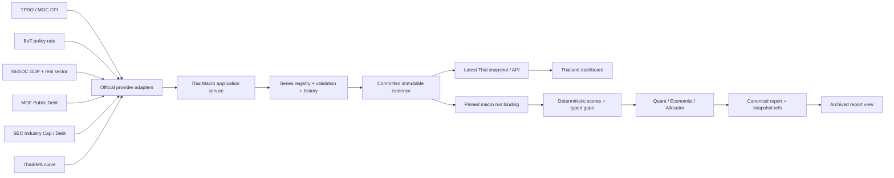

# แผนแก้ไข Thailand Macro Data Gaps ภายใต้ Dual-Track

วันที่: 3 ตุลาคม 2026  
Revision: 3 — เสริม Keyless MOF Public Debt Provider (`packages/provider-mof-th`) สำหรับมิติ Fiscal/Sovereign Debt และ SEC `SECTOR_GROUP` 28 sectors → 8 groups mapping พร้อม `STAT_INDUSTRY_TH.csv` สำหรับเชื่อมโยง Macro Stance สู่ Sector Rotation  
สถานะ: ดำเนินการและผ่านการตรวจสอบ (Implemented & Verified Complete) — ครอบคลุม Wave A, B, C, D พร้อมชุดทดสอบอัตโนมัติทั้ง Backend (Python) และ Frontend (Vitest)
Repository: `invest-agents`; ใช้ working tree ปัจจุบันและรักษาการเปลี่ยนแปลงที่มีอยู่

อ้างอิงใน workspace: 
- [แผน Dual-Track](../docs/macro-intelligence-data-integrity-dual-track-plan.md)
- [แผน AI completeness](../docs/macro-ai-analysis-completeness-plan.md)
- [แผน Sector Rotation verification](sector-rotation-verification-plan.md)
- [Provider MOF Thailand Reference](file:///c:/ChinoDoc/Projects/Claude/invest-agents/temp/zframes-main/packages/provider-mof-th/src/index.ts)
- [Provider SEC Thailand Reference](file:///c:/ChinoDoc/Projects/Claude/invest-agents/temp/zframes-main/packages/provider-sec-th/src/index.ts)

## 1. ปัญหาและผลลัพธ์ที่ต้องได้

ข้อความที่ผู้ใช้พบ:

> สถานะเศรษฐกิจไทย: ยังประเมินไม่ได้ (Data Gaps)  
> Thailand Inflation (CPI/PCE)  
> Thailand Monetary (Policy Rate/Yield Curve)

ระบบต้องประเมินจาก hard data ไทยที่ยืนยันต้นทาง หน่วย ช่วงข้อมูล วันเผยแพร่ และความพร้อมสำหรับสูตรได้ พร้อมแสดงเหตุผลเฉพาะเมื่อข้อมูลไม่พอ แก้ทั้งเส้นทางข้อมูลและการสื่อสารบน dashboard; `Unknown` ยังคงเป็นผลที่ถูกต้องเมื่อเงื่อนไขของการประเมินไม่ผ่าน

ผลส่งมอบ:

1. **Headline CPI, Core CPI และ BoT policy rate** มี provider/period/history/provenance ที่ตรวจได้
2. **Inflation และ Monetary ได้คะแนน** เมื่อ input ที่สูตรต้องใช้ครบ แสดงค่าล่าสุดได้แม้ยังมีประวัติไม่พอสำหรับคะแนน
3. **Growth/GDP dependency** ถูกตรวจและเติมตามเกณฑ์ Dual-Track ก่อนให้ `Thailand economic_state` เป็นสถานะที่ประเมินได้
4. **Thai yield curve** เป็น component แยก มีสถานะและแหล่งข้อมูลของตน; curve ที่ไม่พร้อมไม่ทำให้ policy rate/CPI ที่ยืนยันแล้วหายไป
5. **Dashboard แสดงสถานะรายมิติและ gap reasons** จาก backend; AI อ้างอิง snapshot ที่ตรึงไว้ตลอด run
6. **Provider outage, release delay, revision และ rollback** ไม่สร้าง mock values หรือทำให้หลักฐานรายงานเดิมเปลี่ยน
7. **Sovereign/Fiscal Health ของไทย (MOF Public Debt)**: ดึงยอดหนี้สาธารณะคงค้างรวม, หนี้รัฐบาล, และสัดส่วนหนี้สาธารณะต่อ GDP (`Debt : GDP (%)`) จากสำนักงานบริหารหนี้สาธารณะ กระทรวงการคลัง (MOF) ผ่าน Open Data keyless URL เพื่อใช้ประเมินวินัยการคลัง (Fiscal Discipline) และ Sovereign Buffer เช่นเดียวกับที่ US Macro มีมิติ National Debt
8. **Thai Sector Taxonomy & Market Cap (SET Sector Hierarchy)**: เพิ่มการทำความเข้าใจโครงสร้างอุตสาหกรรมไทยด้วย `SECTOR_GROUP` (28 sectors → 8 industry groups) และสถิติตลาด `STAT_INDUSTRY_TH.csv` เพื่อให้ Macro Stance ของไทยสามารถ aggregate ลงกลุ่มอุตสาหกรรมและ sector rotation ได้ตามมาตรฐานตลาดหลักทรัพย์ฯ

ขอบเขต core repair ครอบคลุม CPI/Core CPI, policy rate, GDP, MPI ที่ใช้ยืนยัน growth และ MOF Public Debt พร้อม dashboard/AI/evidence ส่วน Thai curve มี access gate แยก; SEC migration มีงานตรวจ compatibility ของ adapter เดิมและออกข้อสรุปราย dataset งาน external sector เช่น exports/current account/tourism ในแผน Dual-Track เดิมยังเป็น backlog แยก การปิดแผนนี้ไม่ใช่การประกาศว่า Dual-Track ทั้งโครงการเสร็จแล้ว

## 2. สิ่งที่พบจากโค้ดปัจจุบัน

| ID | สาเหตุ/ความเสี่ยงที่พบ | ตำแหน่ง | งานแก้ |
| --- | --- | --- | --- |
| TH-F01 | `ThaiHardDataAdapter()` default ไม่มี provider; GDP/CPI คืน missing และมีข้อมูลจริงได้ผ่าน `override_records` เท่านั้น | `tools/macro/adapters/thai_hard_data_adapter.py`, `evaluation.py` | เชื่อม provider จริงผ่าน application port/composition root และ cache/evidence |
| TH-F02 | Inflation selector ใช้ CPI/PCE แบบทั่วไป และ label gap เหมือนกันทุกประเทศ | `tools/macro/scoring.py` | ใช้ region/series registry; ไทยใช้ Headline/Core CPI และแยก required/optional |
| TH-F03 | Monetary score ใช้ policy rate + inflation หรือ yield spread; มี rate อย่างเดียวอาจได้ `None` แต่ข้อความ gap ไม่ระบุ dependency ที่ขาด | `tools/macro/scoring.py` | แสดง rate availability แยกจาก score eligibility และ component coverage |
| TH-F04 | ขาด `prev`/`ma` แล้ว `find_metric` แทนด้วย `val` ทำให้ latest-only data ได้ momentum 0 และมีโอกาสได้ regime โดยไม่รู้ทิศทางจริง | `tools/macro/scoring.py` | กำหนด history requirements; insufficient history ต้อง unavailable สำหรับ component ที่ขาด |
| TH-F05 | scorer กรองเพียง `is_valid`; `MarketObservable` ไม่บังคับให้ status กับ flag สอดคล้องกัน | `scoring.py`, `schemas/macro_schemas.py` | shared eligibility ตรวจ verified/status/units/dates/history; contradictory input ถูก reject/exclude |
| TH-F06 | Thai adapter เติมวันนี้เมื่อ observed date ไม่มี และใช้ source labels ที่ไม่ได้ชี้ artifact จริง | `thai_hard_data_adapter.py` | แยก typed gap จาก real observation; บันทึกวันที่จริงและ committed evidence refs |
| TH-F07 | BIS adapter ขอ monthly series `M.TH`; period ถูกเก็บเป็น effective date และ normalizer แปลง `YYYY-MM` เป็นวันแรกของเดือน | `tools/market/terminal_v2/adapters/bis_adapter.py`, `terminal_observables.py` | แยก observation period/effective date; ใช้ daily series หรือ BoT สำหรับ current policy ตาม freshness rule |
| TH-F08 | BIS snapshot ใช้วัน fetch เป็น `as_of_date` และ parser คืน `is_stale=False`; ต้องตรวจ input age เพิ่มก่อนใช้เป็น current policy | `bis_adapter.py` | source-specific release freshness และ policy reconciliation |
| TH-F09 | UI ใช้ AI report เป็นแหล่งของ Thai assessment; ไม่มี report จะถูกแสดง Unknown พร้อม fallback gaps | `ThailandMacroSection.tsx`, `Macro.tsx`, `application/macro/service.py` | latest Thai hard-data read model แยกจาก report state พร้อม report-pinned view |
| TH-F10 | UI บอกทุก non-GDP gap ว่า MOC และ “รอเชื่อมต่อ API ทางการ” แม้สาเหตุเป็น stale/history/dependency; banner ยังบอกใช้ microstructure เท่านั้น | `ThailandMacroSection.tsx`; legacy `ThaiMarketRadarCard.tsx` | structured authority/reason/status และข้อความตามข้อมูลจริง |
| TH-F11 | Regime ต้องมี growth + inflation; เติม CPI/rate อย่างเดียวไม่ยืนยันว่า Unknown จะหาย | `_determine_economic_state`, แผน Dual-Track | Growth/GDP/corroboration gate และ tests ทุก partial combination |
| TH-F12 | Manager จัด valid evidence จาก `is_valid` อย่างเดียวและส่งต่อ observable โดยตัด status/metadata; ตัวอ่าน sidecar และ registry revalidation ยังมีจุดตรวจ flag เดียว | `agents/manager_agent.py`, `evaluation.load_latest_macro_observables`, `MacroStrategyDirection.revalidate_with_registry` | ใช้ eligibility เดียวกันทุก consumer; ส่ง typed evidence context ครบและแยก evidence family |
| TH-F13 | Thai equity fallback ใส่ flow=0, PE=16, A/D=1 เมื่อไม่มี field พร้อม medium confidence และข้อความขายสุทธิ; refs ตรวจแค่ ID มีอยู่ | `agents/manager_agent.py` Thai equity fallback/merged stance | เลิกเติมตัวเลข, confidence/stance/rationale ต้องมาจาก eligible evidence; missing กับเงินจริงเท่าศูนย์แยกกัน |
| TH-F14 | `evaluation` คืน error ก่อนเรียก Thai adapter เมื่อ global/regional/country Markdown ขาด; latest Thai panel จึงต้องไม่ใช้เส้นทางนี้เป็น dependency | `tools/macro/evaluation.py`, macro preparation | latest Thai service ทำงานอิสระ; full report job คืน partial/input error ตาม contract และไม่เติมข้อมูลไทยจาก Markdown fallback |
| TH-F15 | Code มี SEC Thailand adapter อ่าน CSV บน `dividend.sec.or.th` อยู่แล้ว การตรวจเพียงชื่อ API portal จะไม่พบ integration นี้ | `tools/market/terminal_v2/adapters/sec_th_adapter.py` | inventory CSV ทั้งสามและ map ไป dataset ปัจจุบัน; ยืนยันการเลิกใช้/ความเทียบเท่าก่อนเปลี่ยน gateway |
| TH-F16 | สูตรรวม component ตาม input ที่หาเจอ และตีความ momentum ศูนย์เป็น contraction; confidence เพิ่มตาม pillar count | `tools/macro/scoring.py` | ล็อก Thai profile/required inputs/weights และอธิบายว่าเป็น heuristic จากแนวโน้ม ไม่ใช่การยืนยัน recession ทางการ |
| TH-F17 | ขาดมิติ Fiscal Health / หนี้สาธารณะไทย ทั้งที่ US มี National Debt / Deficit; ทำให้การประเมิน sovereign credit และ fiscal buffer ขาดข้อมูลทางการ แม้ MOF มี Open CSV ที่ไม่ต้องใช้ API key | `tools/macro/scoring.py`, `schemas/macro_schemas.py` | สร้าง `mof_th_adapter.py` ดึงยอดหนี้รวมและ `Debt : GDP (%)` จาก `dataservices.mof.go.th` นำแบบอย่างและ parsing rules จาก `packages/provider-mof-th` |
| TH-F18 | Thai sector stance ขาด standardized taxonomy 28 sectors → 8 industry groups; `sec_th_adapter.py` ดึงเพียงกองทุน/ตราสารหนี้ แต่ขาด `STAT_INDUSTRY_TH.csv` และ mapping | `sec_th_adapter.py`, `thai_hard_data_adapter.py` | เพิ่ม `STAT_INDUSTRY_TH.csv`, จัดการ F5 WAF rejection (`assertNotWafRejection`), และใส่ `SECTOR_GROUP` mapping จาก `packages/provider-sec-th` |

การทบทวนพบข้อกำหนดที่ยังเขียนไม่ครบเพิ่มเติม: vintage ตามเวลาที่ระบบรู้ข้อมูล, state/reset ทุก callsite, source import เมื่อ API ใช้ไม่ได้, typed API/flags, Fiscal pillar และ Sector taxonomy เพิ่มรายละเอียดไว้ในข้อ 4–9

## 3. แหล่งข้อมูลและสิ่งที่ยืนยันได้

ตรวจเอกสารทางการวันที่ 3 ตุลาคม 2026:

| ข้อมูล | แหล่งหลัก | สิ่งที่ตรวจพบ / ข้อจำกัด | ทางเลือกเมื่อยังเข้าถึงไม่ได้ |
| --- | --- | --- | --- |
| Headline/Core CPI | TPSO/MOC national CPI history | หน้า BoT SDDS ชี้ CPI ไป `index.tpso.go.th`; มีหน้า MOC history เดิมด้วย ยังไม่ได้ยืนยัน API payload/ไฟล์ latest ที่ใช้งานอัตโนมัติได้ | ใช้ไฟล์/ตารางทางการที่ parse และ validate ได้ หรือ official mirror ที่ยืนยัน series/provenance เดียวกัน |
| Policy rate | BoT Policy Rate API | เอกสาร portal ระบุ `/PolicyRate/v3/policy_rate`, API key ใน header `Authorization`; ยังไม่ได้เรียก gateway ด้วย credentials | BIS daily policy series ที่ผ่าน freshness/definition reconciliation; monthly ใช้ historical context ตาม period |
| Real GDP | NESDC quarterly GDP/CVM tables | ค้นพบหน้า download Excel ทางการ; การ open บางหน้าพบ redirect loop จึงยังไม่ยืนยัน latest workbook ผ่าน tool | ใช้ไฟล์ทางการที่มี release/period/checksum หรือ mirror ที่ตรวจกลับถึง NESDC ได้ |
| Growth corroboration | OIE national Manufacturing Production Index (MPI); BoT official mirror เมื่อเทียบ definition ได้ | เลือก MPI YoY เป็น corroboration สำหรับ v1; BoT SDDS มี MPI และลิงก์ไป OIE ต้องยืนยัน national series/history/base/SA และ machine feed ใน TH-02 | official file import ที่ผ่าน contract; ขาดให้แจ้ง MPI gap ตาม gate |
| Thai government curve | ThaiBMA government yield curve/API | มี government/zero/par curve products, API docs และแบบสมัคร/ทดลองใช้; ต้องยืนยันสิทธิ์และชนิด curve (zframes ยืนยันว่า Terms of Service ไม่อนุญาตให้ scraping/bot) | authorized official export ที่มี 2Y/10Y ตามชนิดเดียวกัน; หากไม่มีให้ curve unavailable |
| Public Debt & Debt-to-GDP | กระทรวงการคลัง (MOF) Data Services (`https://dataservices.mof.go.th/export/csv/menu5?id=4`) | Open CSV keyless ไม่ต้องใช้ API key, อัปเดตรายเดือน (monthly stock); เผยแพร่ยอดหนี้รวม, หนี้รัฐบาล, หนี้รัฐวิสาหกิจ, หนี้ FIDF, และสัดส่วน `Debt : GDP (%)` พร้อมอัตราแลกเปลี่ยนทางการ | ใช้ cached snapshot ใน `runtime/cache` (TTL 12 ชม.) |
| Thai capital-market context | SEC Open Data / SEC Open API ปัจจุบัน | ผู้ใช้ระบุ `secopendata.sec.or.th`; หน้า official มีข้อมูลกองทุน ตราสารหนี้ One Report และตลาดทุน ประกาศ SEC ระบุย้ายจาก Developer Portal เดิม | ตรวจ product/endpoint/auth/pagination/period จาก portal ใหม่ก่อนใช้; ตรวจว่าชุดข้อมูลเหมาะกับ context ที่ต้องการ |
| SET Industry Groups & Sectors | SEC Open Data / Dividend Stat Report (`STAT_INDUSTRY_TH.csv`) | Open CSV keyless สถิติ Market Cap ราย sector และกลุ่มอุตสาหกรรม (Restated quarterly); มีโครงสร้าง 28 sectors และ 8 industry groups ปนในคอลัมน์เดียวกันโดยไม่มี parent column; มี WAF F5 BIG-IP บล็อกหากมี `Origin` หรือ `Accept-Language` header | ใช้ minimal clean headers และ mapping สถิติคอนฟิก `SECTOR_GROUP` |

### ข้อมูลสำคัญที่ได้จาก `temp/zframes-main`:

1. **MOF Public Debt Provider (`packages/provider-mof-th`)**:
   - URL: `https://dataservices.mof.go.th/export/csv/menu5?id=4`
   - นำเข้าข้อมูลหนี้สาธารณะของไทยได้ทันทีโดยไม่ต้องขอ API key
   - ให้ยอดหนี้คงค้างรวม และองค์ประกอบ 5 กลุ่มหลัก:
     1. หนี้รัฐบาล (Government debt)
     2. หนี้รัฐวิสาหกิจ (State-enterprise debt)
     3. หนี้รัฐวิสาหกิจที่เป็นสถาบันการเงินที่รัฐบาลค้ำประกัน (Financial state-enterprise debt)
     4. หนี้กองทุนเพื่อการฟื้นฟูและพัฒนาระบบสถาบันการเงิน (FIDF debt)
     5. หนี้หน่วยงานอื่นของรัฐ (Other government agencies)
   - ให้สัดส่วนหนี้สาธารณะต่อ GDP (`Debt : GDP (%)`) และอัตราแลกเปลี่ยนทางการที่ใช้คำนวณ ณ สิ้นเดือน

2. **SEC Thailand Provider (`packages/provider-sec-th`)**:
   - URL: `https://dividend.sec.or.th/stat-report/STAT_INDUSTRY_TH.csv`
   - ตลาดหลักทรัพย์ฯ เผยแพร่ 28 sectors และ 8 industry groups ในคอลัมน์เดียวกันโดยไม่มี parent column
   - โครงสร้าง `SECTOR_GROUP` เชื่อม 28 sectors เข้าสู่ 8 industry groups อย่างสมบูรณ์
   - ตรวจพบกลไกป้องกัน F5 BIG-IP WAF: เซิร์ฟเวอร์จะคืน HTML `<title>Request Rejected</title>` หาก request มี `Origin` หรือ `Accept-Language` headers ที่เหมือน browser cross-origin fetch; ต้องส่ง request ด้วย minimal headers

## 4. ข้อกำหนดที่ต้องล็อกก่อนเขียน provider

### 4.1 Series และ coverage

| Series logical ID | Observable/การรองรับเดิม | หน่วย/ความถี่ | หน้าที่ |
| --- | --- | --- | --- |
| `TH_CPI_YOY` | รักษา `obs_th_cpi_moc` | `% YoY`, monthly | Required inflation input |
| `TH_CORE_CPI_YOY` | เพิ่ม stable ID เช่น `obs_th_core_cpi_moc` | `% YoY`, monthly | Inflation corroboration; optional สำหรับ regime ขั้นต้น |
| `TH_POLICY_RATE` | เพิ่ม BoT ID; อ่าน legacy `obs_thai_policy_rate_bis` ต่อได้ | `% per annum`, policy event/current-in-force | Required real-policy component input |
| `TH_REAL_GDP` | รักษา `obs_th_gdp_nesdc` | real GDP `% YoY`, quarterly | Required growth input |
| `TH_MPI_YOY` | เพิ่ม stable OIE MPI ID; alias `TH_GROWTH_CORROBORATION` ไป series ที่เลือกใน registry | national MPI `% YoY`, monthly; NSA baseline | Required growth corroboration สำหรับ v1; หาก definition/feed ไม่ผ่านให้ unavailable ไม่สลับตัวอื่นเงียบ ๆ |
| `TH_GOV_YIELD_2Y` / `TH_GOV_YIELD_10Y` | เพิ่ม Thai tenor IDs | `%`, daily EOD | Optional yield-curve component |
| `TH_GOV_10Y_2Y_SPREAD` | เพิ่ม Thai derived ID | `bps`, same-date curve | Optional component; `(10Y% − 2Y%) × 100` |
| `US_TH_POLICY_SPREAD` | รองรับ `obs_diff_us_th_policy_rate` / `_bis` เดิม | `bps`, rate types/as-of compatible | FX/policy divergence; เพิ่ม input IDs/definition |
| `TH_PUBLIC_DEBT_TOTAL` | เพิ่ม MOF ID `obs_th_public_debt_mof` | ล้านบาท (Million THB), monthly | Sovereign Fiscal Health diagnostic; ยอดหนี้สาธารณะคงค้างรวม |
| `TH_DEBT_TO_GDP_PCT` | เพิ่ม MOF ID `obs_th_debt_to_gdp_mof` | `%`, monthly | Fiscal Sustainability diagnostic; สัดส่วนหนี้สาธารณะต่อ GDP (เทียบเพดาน 70%) |
| `TH_SECTOR_MCAP_*` | เพิ่ม SEC ID `obs_th_sector_mcap_sec` | ล้านบาท (Million THB), quarterly | Market Cap สถิติ 28 sectors และ 8 industry groups สำหรับ Sector Stance |

### ตารางมาตรฐาน SET Sector Hierarchy (`SECTOR_GROUP`):

| Industry Group Code | Industry Group Name (ภาษาไทย / อังกฤษ) | Sectors ที่สังกัด (28 Sectors) |
| --- | --- | --- |
| `AGRO` | เกษตรและอุตสาหกรรมอาหาร (Agro & Food Industry) | `AGRI` (ธุรกิจการเกษตร), `FOOD` (อาหารและเครื่องดื่ม) |
| `CONSUMP` | สินค้าอุปโภคบริโภค (Consumer Products) | `FASHION` (แฟชั่น), `HOME` (ของใช้ในครัวเรือน), `PERSON` (ของใช้ส่วนตัวและเวชภัณฑ์) |
| `FINCIAL` | ธุรกิจการเงิน (Financials) | `BANK` (ธนาคาร), `FIN` (เงินทุนและหลักทรัพย์), `INSUR` (ประกันภัยและประกันชีวิต) |
| `INDUS` | สินค้าอุตสาหกรรม (Industrials) | `AUTO` (ยานยนต์), `IMM` (วัสดุอุตสาหกรรมและเครื่องจักร), `PAPER` (กระดาษ), `PETRO` (ปิโตรเคมี), `PKG` (บรรจุภัณฑ์), `STEEL` (เหล็ก) |
| `PROPCON` | อสังหาริมทรัพย์และก่อสร้าง (Property & Construction) | `CONMAT` (วัสดุก่อสร้าง), `CONS` (บริการรับเหมาก่อสร้าง), `PROP` (พัฒนาอสังหาริมทรัพย์), `PF&REIT` (กองทุนรวมอสังหาริมทรัพย์และ REITs) |
| `RESOURC` | ทรัพยากร (Resources) | `ENERG` (พลังงานและสาธารณูปโภค), `MINE` (เหมืองแร่) |
| `SERVICE` | บริการ (Services) | `COMM` (พาณิชย์), `HELTH` (การแพทย์), `MEDIA` (สื่อ), `PROF` (บริการเฉพาะกิจ), `TOURISM` (การท่องเที่ยว), `TRANS` (ขนส่งและโลจิสติกส์) |
| `TECH` | เทคโนโลยี (Technology) | `ETRON` (ชิ้นส่วนอิเล็กทรอนิกส์), `ICT` (เทคโนโลยีสารสนเทศและการสื่อสาร) |

### 4.2 Typed data และ gap contract

Reuse `MacroObservation` สำหรับ real numeric points และ `MarketObservable` สำหรับ AI compatibility เพิ่ม series envelope/structured gap ที่จำเป็น แทนการสร้าง numeric record เมื่อไม่มี observation; `MacroObservation.value` ปัจจุบันเป็น required float จึงไม่ใส่ 0 แทน missing

Series envelope มี logical ID, region, authority/provider, evidence family, source URL/artifact ref, frequency, period, original unit, normalized unit, transform, date precision, publication/effective/fetched timestamps, revision/vintage, `available_at`, `first_seen_at`, input digest, status, history coverage และ evidence refs

Structured gap มี `gap_code`, `pillar`, `series_id`, `required`, `reason_code`, `source_authority`, `source_url`, `latest_period`, `expected_period`, `dependency_ids` และ `next_release_at` เช่น:
- `source_not_configured`, `auth_required`, `source_unavailable`, `rate_limited`, `schema_changed`, `waf_blocked`
- `missing_release`, `stale_release`, `insufficient_history`, `invalid_unit`, `unknown_observation_date`
- `missing_inflation_for_real_rate`, `missing_growth_corroboration`, `source_conflict`

### 4.3 วันที่ ความสดและประวัติ

- Missing observation date ไม่เติมวันนี้; missing series ออก gap object ที่ไม่มี numeric point
- CPI/GDP freshness ตรวจ latest expected published release ณ run as-of และ release calendar/grace period
- Policy rate แยก effective date กับวันที่ต้นทางยืนยัน latest/current rate; ค่าดอกเบี้ยที่ไม่เปลี่ยนหลายเดือนไม่ถือว่า stale
- เริ่ม Thai momentum profile: CPI/MPI MA 12 monthly YoY values และ GDP MA 4 quarterly YoY values; trailing MA รวม current point, `prev` เป็นเดือน/ไตรมาสก่อนหน้าที่ต่อเนื่อง
- ข้อมูล ณ เวลาประเมินและ revisions: ตรึง `evaluation_as_of` เป็น UTC timestamp หนึ่งครั้งต่อ logical task

### 4.4 สูตรและข้อจำกัด

ล็อก baseline `th-hard-data-v1` ดังนี้:

| Output | Required inputs / สูตร v1 | ข้อมูลเสริม |
| --- | --- | --- |
| Momentum `M` | `0.5 × sign(latest − trailing_MA) + 0.5 × sign(latest − prev)`; `sign(0)=0`; history ครบตามข้อ 4.3 | ไม่มี default history หรือ imputation |
| Thai growth | `0.4 × M(real GDP YoY) + 0.6 × M(MPI YoY)`; ต้องครบทั้งสอง series | ไม่เติม retail/tourism/SET ลงสูตรอัตโนมัติ |
| Thai inflation | `−M(Headline CPI YoY)`; weight 1.0 | Core CPI แสดง level/momentum เป็น diagnostic; weight 0 ในสูตรหลัก |
| Primary monetary | real-rate proxy `R = policy % − headline CPI YoY %`; score `+1` เมื่อ `R ≤ 0`, `0` เมื่อ `0 < R ≤ 1`, `−1` เมื่อ `R > 1` percentage points | Curve แสดง spread/status เป็น diagnostic; weight 0 ในสูตรหลัก |
| Thai Fiscal Health | `TH_DEBT_TO_GDP_PCT` และ `TH_PUBLIC_DEBT_TOTAL`; เปรียบเทียบกับเพดานวินัยการคลัง 70% | Diagnostic pillar สำหรับ sovereign risk; weight 0 ใน regime formula v1 |
| Thai regime | ใช้ growth + inflation ที่ eligible ทั้งคู่กับ sign mapping เดิมและ boundary fixtures | Monetary/fiscal/core/curve ไม่ทำให้ required regime gate ผ่านแทน GDP/MPI/CPI |

### 4.5 ทางเลือกไฟล์ทางการและ Technical Footguns

บทเรียนการ parse และ fetch ข้อมูลทางการที่ได้จาก `temp/zframes-main`:

1. **MOF Public Debt (`packages/provider-mof-th`) Footguns**:
   - **UTF-8 BOM**: ไฟล์ CSV ของกระทรวงการคลังมี `\uFEFF` ที่ไบต์แรก หากไม่ตัดออก cell แรกของ header จะผิดเพี้ยนและ match ไม่เจอ
   - **Thai Month & Buddhist Era Headers**: หัวตารางเป็นข้อความภาษาไทย เช่น `มกราคม 2569`, `กุมภาพันธ์ 2569`; ต้องแปลง `พ.ศ. - 543` เป็น ค.ศ. และใช้วันสิ้นเดือนเป็น ISO date (`2026-02-28`) เนื่องจากยอดหนี้คงค้างเป็น month-end stock
   - **Regex Matching แทน String Matching**: แถวหลัก 5 แถวต้องกรองด้วย regex `^\s*([1-5])\.(?!\d)` เพราะกระทรวงการคลังมี typo ในเอกสารจริง เช่น แถว 5 พิมพ์ "ยอดหนื้คงค้าง" (สระอือ แทนสระอี) หากใช้ string match ชื่อแถวจะหลุดทันทีที่ทางการแก้ไขการสะกด
   - **Debt to GDP Row**: ตรวจหาด้วย regex `/debt\s*:\s*gdp/i` และเก็บค่าสัดส่วนเปอร์เซ็นต์
   - **หน่วยล้านบาท**: ตัวเลขยอดหนี้ทั้งหมดเผยแพร่เป็น "ล้านบาท" ต้องคูณ `1e6` เมื่อต้องการค่าบาทเต็ม

2. **SEC Thailand (`packages/provider-sec-th`) Footguns**:
   - **F5 BIG-IP WAF Rejection**: Web Application Firewall ของ ก.ล.ต. (`dividend.sec.or.th`) จะดักจับคำขอที่มี header `Origin` หรือ `Accept-Language` และส่ง HTML 200 พร้อมข้อความ `<title>Request Rejected</title>` ทำให้ CSV parser อ่านได้เป็น 1 row เปล่า; ต้องตรวจสอบด้วย `assertNotWafRejection` และส่ง minimal clean headers เสมอ
   - **Whitespace ใน Sector Codes**: ชื่อ sector ใน CSV ของ ก.ล.ต. มักมี trailing spaces (เช่น `"BANK  "`, `"PROP  "`) ต้องใช้ `.strip()` เสมอ
   - **Placeholder `-` ในตาราง**: ช่องที่มีเครื่องหมาย `-` คือ absent/missing data ห้ามแปลงเป็น `0` เพราะจะทำให้กราฟเกิด false trough

## 5. สถาปัตยกรรมและเส้นทางข้อมูล

- Application service รับ ports; routers ไม่มี HTTP provider calls หรือ filesystem writes
- Provider แยกตาม source:
  - `MocCpiAdapter` (TPSO/MOC)
  - `BotPolicyRateAdapter` (BoT / BIS)
  - `NesdcGdpAdapter` (NESDC)
  - `OieMpiAdapter` (OIE)
  - `MofPublicDebtAdapter` (MOF - `packages/provider-mof-th`)
  - `SecIndustryAdapter` (SEC - `packages/provider-sec-th`)
- Cache/raw responses อยู่ runtime; canonical evidence ผ่าน `KnowledgeWritePort`/broker เท่านั้น
- Prepare Thai snapshot ก่อน LLM แล้วบันทึก `thailand_macro_snapshot_id`/versions ลง run binding

## 6. Work breakdown และ dependencies

| งาน | Priority | งานลงมือ/ไฟล์หลัก | เกณฑ์ส่งมอบ | ประมาณ |
| --- | --- | --- | --- | --- |
| TH-01 Trace actual gap | P0 | trace quant input → `scoring.py` → report/DTO → UI; บันทึก hashes ของ working tree | จำแนก missing feed, stale, history, dependency และ old report ได้ | 0.5 วัน |
| TH-02 Source feasibility + contracts | P0 | official source inventory, concrete MPI series, registry, scoring/confidence/freshness/budget profile | captured payload/workbook, versioned expected fixtures และ access blockers ราย source; ตรวจ latest span | 1 วัน |
| TH-03 Eligibility/date/history guardrails | P0 | shared validator ทุก consumer ในข้อ 4.2/5.1, schema, Manager fallback | status/as-of/history verdict ตรงกัน, ไม่มีเลข fallback, preserved US/Euro/legacy reads | 1–1.5 วัน |
| TH-04 CPI/Core CPI provider | P1 | MOC/TPSO adapter; typed series/history; modify `ThaiHardDataAdapter` composition | latest/prior/MA/YoY/period/base/revision ตรงต้นทาง; headline เป็น required | 1–2 วัน |
| TH-05 Policy rate + BIS reconciliation | P1 | BoT provider, Terminal V2 BIS models/adapter/mapping, derived spread | rate type/effective/observation/freshness ถูก; current rate ไม่ relabel monthly; source conflict เห็นชัด | 0.5–1.5 วัน |
| TH-06 Growth dependency | P1 | NESDC GDP + OIE national MPI provider; concrete transform/history/gates | economic_state ออกได้เฉพาะ growth/inflation gate ครบ ไม่ใช้ SET แทน | 1.5–2 วัน |
| TH-07 Thai yield curve | P2 / separate access gate | reuse/add authorized curve port/adapter; 2Y/10Y/spread metadata | same-date/type/tenor; ถ้าไม่มีสิทธิ์ระบุ blocked component ไม่ใช้ static TH10Y | 0.5–1.5 วัน หลังได้สิทธิ์ |
| TH-08 Evidence/cache/run binding | P1 | service, broker, vintage manifest, every caller/sidecar/formatter ในข้อ 5.1 | as-of/revision correct, crash recovery, report reconstructable, retry pinned, parallel jobs isolated | 1.5–2 วัน |
| TH-09 Regional scoring + AI context | P1 | versioned Thai profile, Manager/Economist/Allocator typed contexts/validator | fixed selectors/weights/coverage/confidence, no fabricated fallback, heuristic labels, no legacy bypass | 1 วัน |
| TH-10 API + dashboard | P1 | typed DTO/routes/generated TS, flags/contracts ข้อ 5.2, Thai section/radar | latest ไม่รอ AI/US Markdown, status/authority/source drawer/archive ถูก, auth/budgets ผ่าน | 1–1.5 วัน |
| TH-11 Verification + live shadow | P1 | fixtures/unit/integration/UI/live checks ตาม matrix ด้านล่าง | tests หลัก, official reconciliation, real AI report lineage และ recovery ผ่าน | 1–2 วัน |
| TH-12 Operations/rollout | P1 | refresh command/log/runbook, flags, completion report | provider statuses/expected release มองเห็น, rollback/old evidence ผ่าน | 0.5 วัน |
| TH-13 Official file-import fallback | P1 | ingest manifest + CSV/Excel parser adapters ผ่าน service/broker เดียวกัน | provenance/vintage/encoding/unit ตรวจได้, API/ไฟล์ให้ equivalent output, ไม่มี manual verified switch | 0.5–1 วัน |
| TH-14 SEC compatibility audit & Sector Group | P1 | CSV adapter เดิมสาม datasets + `STAT_INDUSTRY_TH.csv` map ไป dataset ปัจจุบัน, `SECTOR_GROUP` 28 sectors → 8 groups | ระบุ keep/migrate/unavailable พร้อมหลักฐานทีละชุด; รองรับ F5 WAF check; map 28 sectors เข้า 8 industry groups ครบ | 0.5–1 วัน |
| TH-15 Thailand MOF Public Debt Provider | P1 | `mof_th_adapter.py` ดึง `dataservices.mof.go.th/export/csv/menu5?id=4` นำแบบอย่างจาก `packages/provider-mof-th` | จัดการ BOM, หัวตารางเดือน พ.ศ., หน่วยล้านบาท, สัดส่วน `Debt : GDP (%)`, แถว 1-5 regex, และอัตราแลกเปลี่ยน | 0.5–1 วัน |

### แผนการแบ่งเป็น Waves:

- **Wave A — แก้สถานะ/guardrails ก่อน**: TH-01–03, service contract และ TH-14 source audit; ปิด fabricated Manager fallback, จัดการ label และ status แยกจาก AI report
- **Wave B — CPI + policy + primary monetary + Fiscal Health**: TH-04/05/08/09/13/15 ผ่าน deterministic + official reconciliation; ได้ Headline CPI, BoT Policy Rate, และ MOF Public Debt / Debt-to-GDP บน Dashboard
- **Wave C — ประเมิน regime ไทยและ Sector Rotation**: TH-06 growth + corroboration, TH-14 SEC Sector Group & Industry Stats, TH-10/11/12 ผ่าน; ประเมินสภาวะเศรษฐกิจไทยได้จริง พร้อม Sector Taxonomy
- **Wave D — เพิ่ม Thai curve coverage**: TH-07 กับ same-date/units/freshness/live comparisons ผ่านจึงเปิด curve component (หลังผ่าน access gate ของ ThaiBMA)

## 7. การแก้ UI และข้อความที่ควรแสดง

Latest Thai hard-data panel แสดง Headline CPI/Core CPI, policy rate, GDP, MOF Public Debt (`Debt : GDP (%)`) และ optional curve พร้อม value/unit/period/source/status เป็นข้อมูล deterministic แยกจาก prose ของ AI

| สถานการณ์ | ข้อความ/พฤติกรรม |
| --- | --- |
| ไม่มี AI report หรือกำลังโหลด | “กำลังโหลดข้อมูล” / “ยังไม่มีรายงาน AI”; latest official data ยังเปิดได้ |
| CPI verified แต่ประวัติไม่พอ | แสดง CPI ล่าสุด; “ประวัติยังไม่พอคำนวณแนวโน้มเงินเฟ้อ” |
| Policy rate verified แต่ CPI ขาด | แสดง policy rate; “ยังคำนวณดอกเบี้ยจริงไม่ได้: ขาด CPI ที่ยืนยันแล้ว” |
| Inflation/Monetary พร้อมแต่ Growth ขาด | แสดงสองมิติที่ใช้ได้; overall Unknown พร้อม GDP/corroboration reason |
| Growth/Inflation gate ครบ | แสดง computed regime/coverage พร้อม config/period; optional gap ไม่บังคับ Unknown |
| Public Debt แสดงผล | แสดงสัดส่วน `Debt : GDP (%)` และยอดหนี้คงค้างรวมจากกระทรวงการคลัง (MOF) |
| Provider outage แต่ last-good ยัง eligible | แสดงวันจริงและ refresh warning; ใช้ได้ตาม cadence policy |
| Last-good stale | แสดงข้อมูลเก่าพร้อม stale label; ตัดออกจาก new scoring/AI evidence |
| API ไม่มี key/สิทธิ์ | “ยังไม่ได้ตั้งค่าการเข้าถึงข้อมูล BoT/ThaiBMA”; ระบุ source ถูก ไม่ใช้คำว่า API ล่ม |
| Archived report | แสดง pinned assessment/refs/as-of; latest data แสดงเป็นอีก panel พร้อมวันที่ |

## 8. Acceptance matrix

| ID | กรณี | ผลที่ต้องได้ |
| --- | --- | --- |
| TH-AC01 | source ไม่ configured / key ขาด / 401 / 429 / timeout / schema เปลี่ยน | reason code ถูก, isolated source failure, ไม่มีค่าจำลอง |
| TH-AC02 | CPI index 100→103 เทียบเดือนเดียวกันปีก่อน | 3% YoY; official YoY ที่ส่งมาแล้วไม่ถูก transform ซ้ำ |
| TH-AC03 | CPI headline/core, YoY/MoM, national/regional, actual/forecast ปน | เลือก explicit logical series; forecast/ผิด definition ไม่เข้าคะแนน |
| TH-AC04 | CPI index base เปลี่ยน/ย้อนหลัง revision | ไม่คำนวณข้าม base โดยไม่มี linkage; new digest/snapshot, archive เก่ายังอยู่ |
| TH-AC05 | ขาดเดือน/ไตรมาส หรือมี latest แต่ไม่มี prior/MA | latest card แสดงได้; score unavailable ตาม history requirements ไม่กลายเป็น neutral |
| TH-AC06 | เงินเฟ้อ 0/ติดลบ และ non-finite values | 0/negative valid เมื่อหน่วย/ต้นทางถูก; NaN/Inf invalid |
| TH-AC07 | ไม่มี observed date / BE date / monthly period / released หลัง run as-of | ไม่เติมวันนี้, normalize พร้อม precision, ไม่มี future information |
| TH-AC08 | CPI/GDP ก่อน release ใหม่ / เลย grace / release calendar ไม่ทราบ | freshness เหมาะกับ cadence; uncertainty เป็น reason ไม่ปลอมเป็น fresh |
| TH-AC09 | policy rate ไม่เปลี่ยนหลายเดือนแต่ current source ยืนยัน | current-in-force valid; ไม่ stale เพราะ effective date เก่าอย่างเดียว |
| TH-AC10 | BIS monthly / daily / effective date / last change | ไม่มีการอ้างวันที่ 1 เป็น MPC effective date; historical/current แยกกัน |
| TH-AC11 | BoT กับ BIS ต่างกันช่วง lag/source conflict | deterministic priority/reconciliation, selected-source evidence และ downgrade reason ชัด |
| TH-AC12 | Rate 2.5%, CPI 1.0% (fixture) | real proxy 1.5 percentage points พร้อม input IDs; ไม่ใช่ 1.5 bps |
| TH-AC13 | มี rate แต่ CPI ขาด / curve ขาด | rate card ยังมีค่า; primary monetary gap ระบุ CPI; optional curve ไม่ซ่อน rate |
| TH-AC14 | Thai curve 10Y 3.0%, 2Y 2.5% (fixture) | 50 bps; ต่างวันที่/type/tenor ไม่ผ่าน derived eligibility |
| TH-AC15 | GDP nominal/real/CVM/SA/YoY/QoQ mixed | exact series/transform; 100→102 เทียบปีก่อนให้ real YoY 2% เมื่อ raw definition ถูก |
| TH-AC16 | GDP+CPI แต่ corroboration ไม่ผ่าน / CPI+rate แต่ GDP ขาด | ตาม growth/coverage gate; ไม่ force known เพื่อให้ warning หาย |
| TH-AC17 | มีเฉพาะ SET flow/breadth/gold หรือ US CPI | Thai regime Unknown, market stance เปิดตามหลักฐาน; ไม่มี cross-region substitution |
| TH-AC18 | `is_valid=true` แต่ status stale/mock/unverified | exclude จาก score/coverage/valid AI evidence; contradictory data มี diagnostic |
| TH-AC19 | ค่าซ้ำ primary/mirror/BIS หรือ Headline/Core selector | dedup ต่อ logical series; scoring/config deterministic ไม่ขึ้นกับ row order |
| TH-AC20 | Growth/Inflation ทุก sign combination + boundary | computed regime ตรง versioned rules; availability ไม่บังคับ regime ทิศใด |
| TH-AC21 | Provider outage/commit fail/cold refresh พร้อมกัน | last-good/error ถูก, bounded/coalesced work, ไม่ publish uncommitted evidence |
| TH-AC22 | Retry task เดิมหลัง source revision/latest เปลี่ยน | pinned Thai snapshot/config เดิม; task ใหม่เลือก revision ใหม่ตาม policy |
| TH-AC23 | LLM เพิ่ม CPI/rate/period/unit/ref หรือแต่ง growth | Python authoritative values คงเดิม; unsupported claims rejected/unavailable |
| TH-AC24 | Macro Web กับ CLI และ Economist input | snapshot/score/gaps/versions/refs เดียวกัน; capture actual prompt handoff |
| TH-AC25 | UI no-report/loading/partial/stale/provider auth gap | แสดง status/source/reason ถูก และ latest hard data ไม่หายเพราะ AI unavailable |
| TH-AC26 | Typed DTO/generated TS + desktop/mobile/source drawer | null ไม่เป็น 0, authority/period/as-of/units ถูก, evidence link เปิดได้ |
| TH-AC27 | Old report ไม่มี Thai typed fields; archive runtime copy หาย | legacy view ไม่ crash; recover committed revision ไม่เลือก latest แทน |
| TH-AC28 | Flags off/rollback source/config + API authentication | no new disabled production; authorized archive ยังอ่านได้; data sectionsอื่นไม่ล้ม |
| TH-AC29 | Thai equity fallback: field absent/None, nested empty dict, flow 0/positive/negative, stale ref | ไม่มี PE=16/A-D=1/flow=0 แทน missing, ไม่มีขายสุทธิผิด sign, confidence/stance/supporting refs ตรง eligible evidence; missing allocation delta ไม่กลายเป็น 0% |
| TH-AC30 | Manager/Economist/Allocator/stance/sidecar ได้ status contradiction หรือ latest-only history | shared verdict ต่อ use case ตรงกัน; preserve typed metadata, market family ไม่กลายเป็น macro evidence; level ใช้ได้แม้ momentum ไม่พร้อม |
| TH-AC31 | CPI/GDP period เดียวกันมี revision A/B; historical as-of ก่อน/หลัง revision | เลือก vintage ที่รู้ได้จริง, ไม่มี current revision ย้อนใส่เก่า, missing archive ให้ `missing_vintage`, reconstruct score จาก history manifest ได้ |
| TH-AC32 | Release หลัง intraday cutoff, date-only release, policy announcement ก่อน effective date | BKK/UTC normalization ถูก, conservative time-precision policy, current rate ก่อน effective ยังเป็น rate เดิม; no future information |
| TH-AC33 | History MA boundary/current inclusion, index rebase, provisional→final | count/prev/MA ตรง frozen profile, provenance/available-at ทุก input, revision ใหม่มี digest ใหม่; rounding เพื่อแสดงผลไม่เปลี่ยน score |
| TH-AC34 | Data/AI flags ทั้งสี่ combinations, process restart/worker env | ผลตรงตารางข้อ 5.2, disabled ไม่ enqueue, archive read authorized, ไม่มี flag UI อย่างเดียวหรือ context ค้างหลัง restart |
| TH-AC35 | Web/CLI/tool retry/replan/new task + สอง jobs/vaults พร้อมกัน | persist binding ก่อน LLM, retry คง snapshot/config/as-of เดิม, new task reset, context propagation/isolation ถูก ไม่มี refresh แทรกระหว่าง run |
| TH-AC36 | รายงานสองฉบับวันเดียวกันคนละ snapshot; runtime sidecar หาย | archive/strategy DTO/source drawer อ้าง canonical Thai binding ของตน ไม่มี date-only overwrite/latest substitution; legacy ไม่มี binding ระบุ lineage unavailable |
| TH-AC37 | US/Euro inputs หายหรือ legacy verified ต่าง schema, Sector Rotation context | latest Thai ยังอ่านได้; full job partial/error เป็น typed contract, Thai gate ไม่ถูก Markdown/US feed ข้าม; US risk/Euro/sector semantics ไม่เปลี่ยนโดยไม่ตั้งใจ |
| TH-AC38 | Cache same-day release, vault/config ต่างกัน, concurrent commit/crash/restart | key isolation, new release refresh ได้, normalized unchanged evidence reuse, assessment cutoff เก็บแยก, latest pointer ไม่ชี้ uncommitted/หาย |
| TH-AC39 | Cold/warm/disabled/unknown snapshot/invalid request/cooldown + provider auth/service failure | HTTP/DTO ตรงข้อ 5.2, GET ไม่เรียก provider, budgets/p95 วัดจริง, 429 reschedule ไม่เกิน budget, ไม่มี secret ใน error/source refs |
| TH-AC40 | API unavailable แต่ official CSV/Excel import พร้อม; BOM/BE/header/blank/HTML-WAF | output equivalent ตาม contract, artifact/provenance/vintage ตรวจได้, blank ไม่เป็น 0, checksum อย่างเดียวไม่เป็น verified proof |
| TH-AC41 | SEC CSV ยัง active / retired / API ไม่ equivalent / paginated duplicates | keep/migrate/unavailable มีหลักฐาน dataset-level, units/period/BE/granularity ถูก, fund/bond ไม่เพิ่ม Thai GDP/CPI/sector coverage; key ไม่ปน US SEC |
| TH-AC42 | Frozen Thai weights/thresholds/coverage/confidence; optional core/curve on/off; growth momentum 0 | scores/eligibility deterministic, optional feeds ไม่เปลี่ยน composite/required coverage; disagreement cap/Unknown confidence ตรง profile; ไม่ยืนยัน GDP contraction/official recession จาก heuristic label |
| TH-AC43 | MOF Public Debt CSV parsing: UTF-8 BOM, เดือน/ปี พ.ศ., หน่วยล้านบาท, สัดส่วน `Debt : GDP (%)`, regex `^[1-5]\.` (ป้องกัน typo หนื้/หนี้), อัตราแลกเปลี่ยน | แปลง date เป็น last-day of month ISO date (`2026-02-28`), parse component หนี้ครบทั้ง 5 กลุ่ม, ค่า `Debt : GDP (%)` ถูกต้อง, network error/schema change จัดการ gracefully |
| TH-AC44 | SEC F5 WAF rejection avoidance & `STAT_INDUSTRY_TH.csv` parsing | ตรวจจับ WAF rejection `<title>Request Rejected</title>` ได้, ส่ง minimal clean headers, trim whitespace ของ sector codes, และ map ครบ 28 sectors เข้าสู่ 8 industry groups ตาม `SECTOR_GROUP` โดยไม่ตกหล่น |

### Traceability: finding → งาน → acceptance

| Finding | งานหลัก | Acceptance |
| --- | --- | --- |
| TH-F01 | TH-02/04/06/08/13 | TH-AC01/03/15/40 |
| TH-F02 | TH-02/09/10 | TH-AC03/19/25/42 |
| TH-F03 | TH-05/09/10 | TH-AC12/13/30 |
| TH-F04 | TH-03/04/06/09 | TH-AC05/16/33/42 |
| TH-F05 | TH-03/09 | TH-AC18/23/30 |
| TH-F06 | TH-03/08/13 | TH-AC07/31/32/40 |
| TH-F07 | TH-05 | TH-AC09/10/11/32 |
| TH-F08 | TH-02/05 | TH-AC08/09/11 |
| TH-F09 | TH-08/10 | TH-AC25/26/36/37 |
| TH-F10 | TH-10 | TH-AC01/13/25/26 |
| TH-F11 | TH-02/06/09 | TH-AC16/17/20/42 |
| TH-F12 | TH-03/08/09 | TH-AC18/23/24/30/36 |
| TH-F13 | TH-03/09 | TH-AC23/29/30 |
| TH-F14 | TH-08/10 | TH-AC25/35/37 |
| TH-F15 | TH-02/14 | TH-AC41 |
| TH-F16 | TH-02/09/10 | TH-AC19/20/42 |
| TH-F17 | TH-02/15 | TH-AC43 |
| TH-F18 | TH-02/14 | TH-AC44 |

## 9. ชุดตรวจสอบและการส่งมอบ

- ขยาย `tests/tools/macro/test_scoring_and_evaluation_guardrails.py`, `test_evaluation_quant.py`, `test_terminal_observables.py` และ Thai hard-data fixtures โดยรักษา existing working-tree edits
- เพิ่ม targeted provider tests สำหรับ MOC/BoT/NESDC/MOF และ source-specific date/freshness/revision; fake HTTP/captured official data แยกจาก live calls
- เพิ่ม OIE MPI, official-file importer, MOF public debt parser, และ SEC adapter compatibility checks
- ตรวจสอบ `SECTOR_GROUP` mapping ครบทั้ง 28 sectors และ 8 industry groups และทดสอบกรณี F5 WAF rejection ด้วย fixture HTML
- ตรวจสอบการแปลงปฏิทิน พ.ศ. สู่ ค.ศ. และวันสิ้นเดือนสำหรับ MOF Debt และ SEC Industry Cap
- Regenerate OpenAPI/TS เมื่อ contract เปลี่ยน ตรวจ type drift/build และ Macro/Portfolio/Sector Rotation regression
- Live source reconciliation ใน scratch: latest period + history samples อย่างน้อย 2 periods ต่อ CPI/GDP/MPI/Debt, rate current/in-force และ curve เมื่อมีสิทธิ์

Definition of Done สำหรับ core repair:

- [x] TH-F01–18 มีการแก้/ข้อสรุป compatibility และหลักฐานตรง traceability matrix
- [x] Headline/Core CPI และ policy provider/status/current-in-force ตรงต้นทาง
- [x] History/units/release freshness/gap contract ไม่สร้างตัวเลขหรือวันที่แทน missing
- [x] Growth/GDP/corroboration dependency ตรง Dual-Track และ overall state เป็นผลสูตรจริง
- [x] Latest UI และ report-pinned AI view แสดง source/date/status ถูก
- [x] Shared eligibility ทุก consumer, Manager fallback, typed context และ US/Euro/Sector regression ผ่าน
- [x] Vintage/available-at/history manifest, as-of binding/parallel isolation และ canonical report reconstruction ผ่าน
- [x] Official import, SEC audit, และ MOF public debt adapter มีผล dataset-level ชัด
- [x] `SECTOR_GROUP` mapping 28 sectors → 8 industry groups เชื่อมโยงได้สมบูรณ์และผ่านการทดสอบ
- [x] TH-AC01–44 ผ่านตาม scope; curve live subcase มีผลผ่านหรือ blocked ที่ระบุชัดก่อนอ้าง full curve scope
- [x] Real AI shadow report, official captures, failure/recovery และ rollback evidence ครบ

## 10. งานที่ทำในการวางแผนครั้งนี้

Revision 3: นำการค้นพบจาก `temp/zframes-main` มาเสริมแผนงาน 2 ส่วนหลัก:
1. **Keyless MOF Public Debt Provider (`packages/provider-mof-th`)**: เพิ่มมิติ Sovereign Fiscal Health (หนี้สาธารณะรวม, องค์ประกอบหนี้ 5 กลุ่ม, สัดส่วนหนี้สาธารณะต่อ GDP `Debt : GDP (%)` เทียบกับกรอบวินัยการคลัง 70%) พร้อมถอดบทเรียนการจัดการ UTF-8 BOM, วันที่ พ.ศ., หน่วยล้านบาท, และ regex `^[1-5]\.` (TH-F17, TH-15, TH-AC43)
2. **SET Sector Taxonomy & Market Cap (`packages/provider-sec-th` & `SECTOR_GROUP`)**: นำโครงสร้างการจำแนก 28 sectors เข้าสู่ 8 industry groups ของตลาดหลักทรัพย์ฯ และสถิติ `STAT_INDUSTRY_TH.csv` มาเสริมการวิเคราะห์ sector rotation ของไทย พร้อมถอดบทเรียนการหลบเลี่ยง F5 BIG-IP WAF block ด้วย minimal clean headers และ whitespace trimming (TH-F18, TH-14, TH-AC44)
